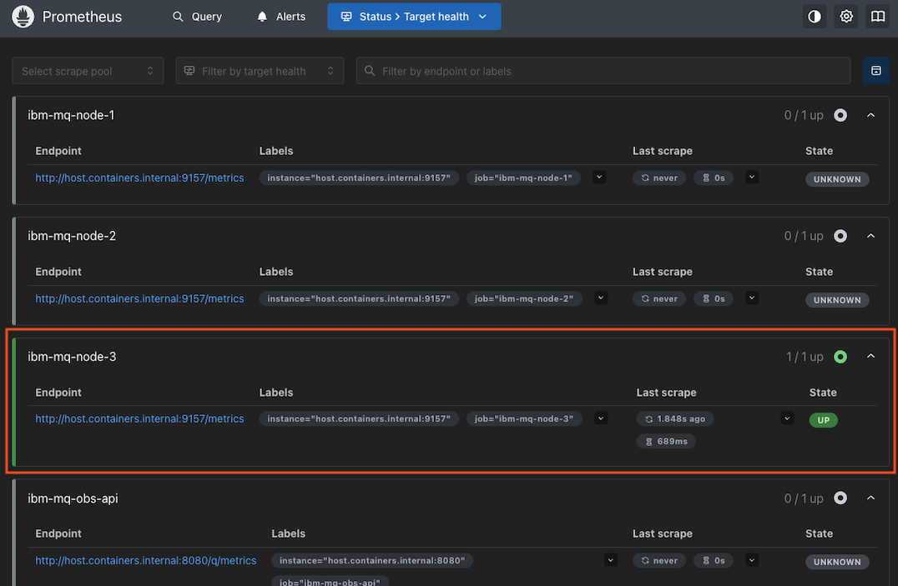
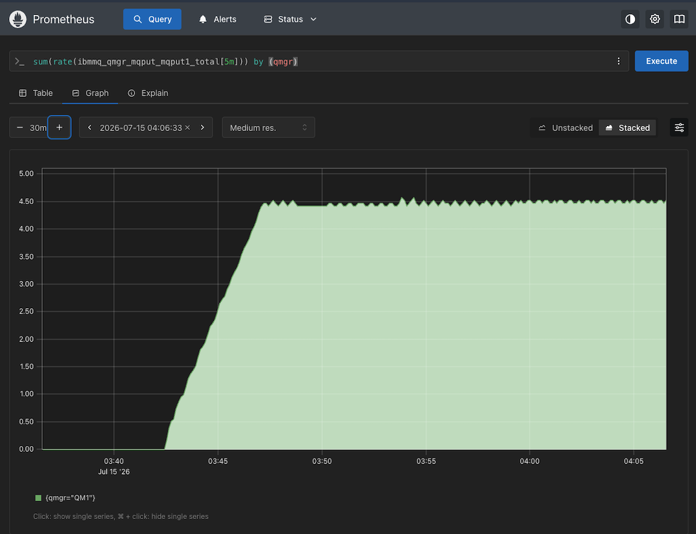
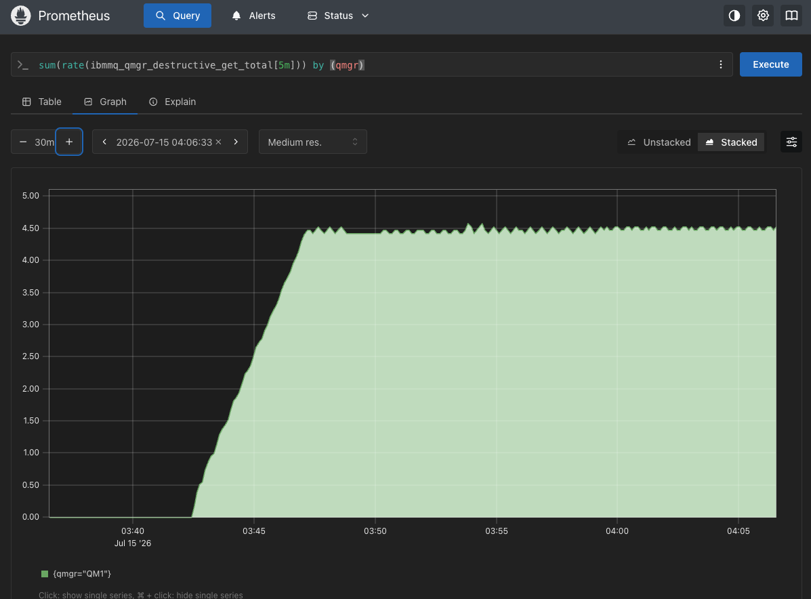
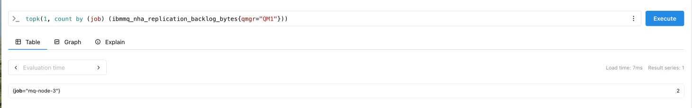
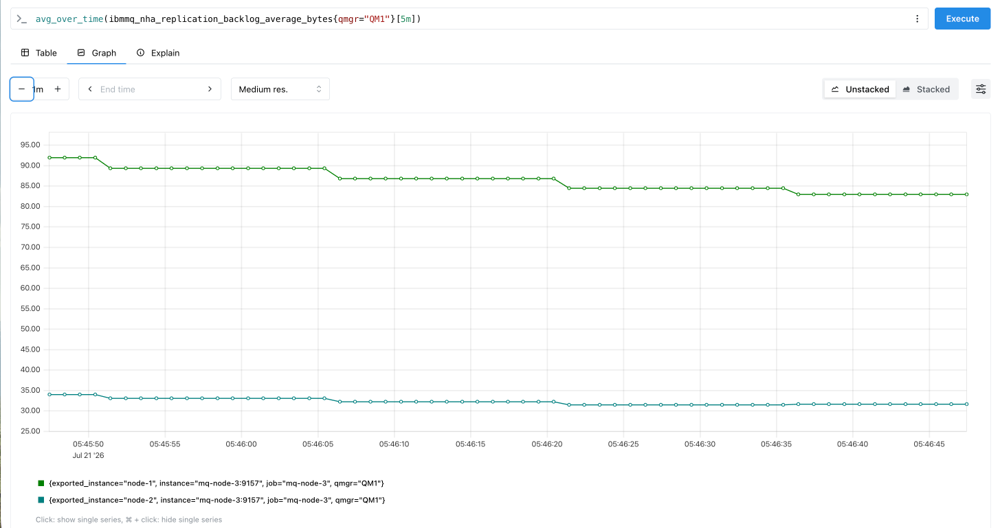
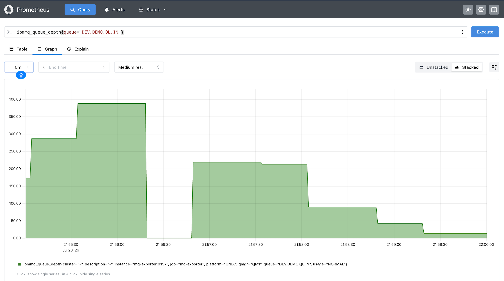
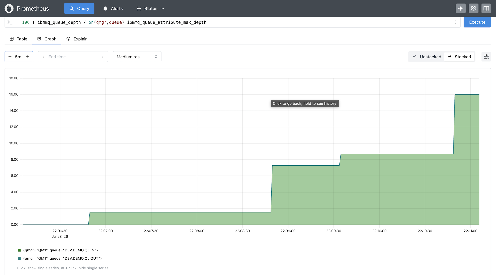
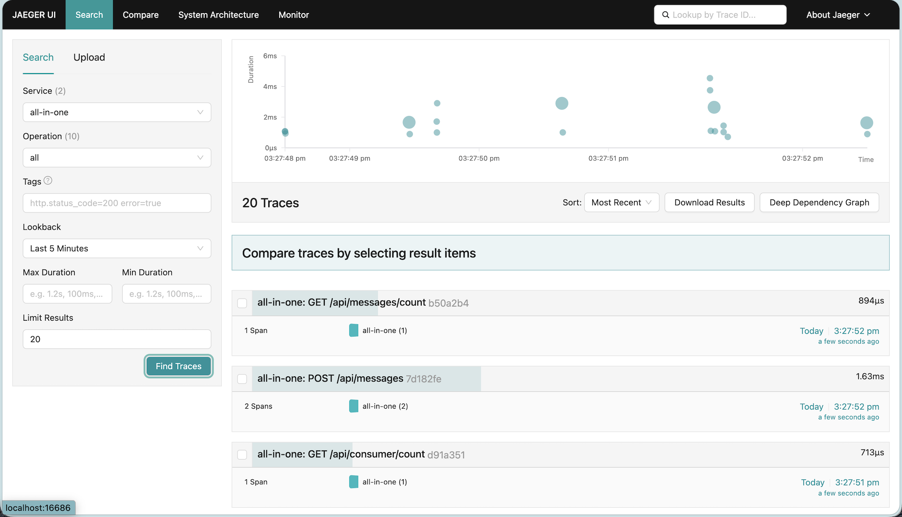
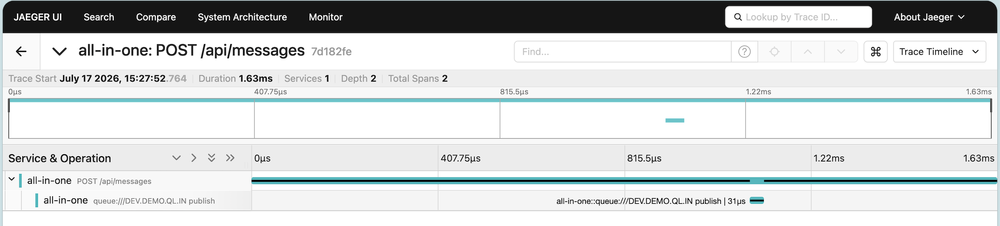

# Observability
## Architecture

```
  ┌────────────────────────┐
  │  Grafana               │
  │  (container) :3000     │
  └────────────────────────┘
               │
               │  (via host.containers.internal — exits mq-ha-net to host)
               ▼
  ┌───────────────────────────────── mq-ha-net (podman network) ───────────────────────────────┐
  │                                                                                            │
  │   ┌─────────────────┐  scrape :9157   ┌── HA-GROUP-1 (QM1) ──────────────────────────────┐ │
  │   │                 │ ──────────────► │  mq-node-1  :9157  (Active QM1)          ✅ up    │ │
  │   │                 │ - - - - - - - ► │  mq-node-2  :9157  (Replica)             ❌ down  │ │
  │   │                 │ - - - - - - - ► │  mq-node-3  :9157  (Replica)             ❌ down  │ │
  │   │                 │                 └──────────────────────────────────────────────────┘  │
  │   │                 │  scrape :9157   ┌──────────────────────────────────────────────────┐  │
  │   │                 │ ──────────────► │  mq-exporter     :9157 (QM1 per-queue depth) ✅   │  │
  │   │                 │                 │  MQ client → follows QM1's Active node            │  │
  │   │   Prometheus    │                 └──────────────────────────────────────────────────┘  │
  │   │   :9090         │  scrape :9157   ┌── HA-GROUP-2 (QM2) ──────────────────────────────┐  │
  │   │                 │ ──────────────► │  mq-node-4  :9157  (Active QM2)          ✅ up    │  │
  │   │                 │ - - - - - - - ► │  mq-node-5  :9157  (Replica)             ❌ down  │  │
  │   │                 │ - - - - - - - ► │  mq-node-6  :9157  (Replica)             ❌ down  │  │
  │   │                 │                 └──────────────────────────────────────────────────┘  │
  │   │                 │  scrape :9157   ┌──────────────────────────────────────────────────┐  │
  │   │                 │ ──────────────► │  mq-exporter-qm2 :9157 (QM2 per-queue depth) ✅   │  │
  │   │                 │                 │  MQ client → follows QM2's Active node            │  │
  │   └────────┬────────┘                 └──────────────────────────────────────────────────┘  │
  │            │ scrape host.containers.internal:8080 /q/metrics                                │
  └────────────┼────────────────────────────────────────────────────────────────────────────────┘
               │
               │  (via host.containers.internal — exits mq-ha-net to host)
               ▼
  ┌────────────────────────┐    OTLP gRPC       ┌────────────────────────┐
  │  Quarkus all-in-one    │ ────:4317────────► │  Jaeger                │
  │  (host) :8080          │                    │  (container) :16686 UI │
  └────────────────────────┘                    └────────────────────────┘

 
```

> **Note:** Prometheus joins `mq-ha-net` to reach MQ containers by their internal addresses.
> Grafana and Jaeger run without a named network and communicate via exposed host ports.

## IBM MQ Metrics

Metrics can be enabled by environment variable *MQ_ENABLE_METRICS=true* for container or use following configuration in MQSC config

```bash
ALTER QMGR STATMQI(ON) STATQ(ON) STATCHL(LOW) ACCTMQI(ON) ACCTQ(ON)
```

Sample metrics

|                     Prometheus Metric                     |                Maps to MQ metric               |
|:---------------------------------------------------------:|:----------------------------------------------:|
| ibmmq_qmgr_cpu_load_fifteen_minute_average_percentage     | CPU 15-min avg %                               |
| ibmmq_qmgr_ram_usage_estimate_for_queue_manager_bytes     | RAM used by QM (bytes)                         |
| ibmmq_qmgr_log_write_latency_seconds                      | Log write latency                              |
| ibmmq_qmgr_log_primary_space_in_use_percentage            | Log primary space % used                       |
| ibmmq_queue_depth                                         | Current queue depth                            |
| ibmmq_queue_oldest_message_age                            | Oldest msg age                                 |
| ibmmq_queue_mqput_mqput1_total                            | PUT count                                      |
| ibmmq_queue_destructive_mqget_total                       | GET count                                      |
| ibmmq_channel_status                                      | Channel state (MQCHS_* values)                 |
| ibmmq_channel_status_squash                               | Simplified: 0=stopped, 1=transition, 2=running |
| ibmmq_channel_bytes_sent                                  | Channel throughput                             |

### Native HA specific metrics

|                        Prometheus Metric                        |            Maps to MQ metric            |
|:---------------------------------------------------------------:|:---------------------------------------:|
| ibmmq_nha_replication_backlog_bytes                             | Bytes pending replication to a replica  |
| ibmmq_nha_replication_backlog_average_bytes                     | Rolling-average replication backlog     |
| ibmmq_nha_replication_synchronous_log_sent_bytes                | Log bytes replicated synchronously      |
| ibmmq_nha_replication_average_network_round_trip_time_seconds   | Replication network round-trip time     |
| ibmmq_nha_replication_log_write_average_acknowledgement_latency_seconds | Replica log-write acknowledgement latency |
| ibmmq_nha_replication_queue_manager_file_system_free_space_percent | QM data filesystem free %             |

> **No direct role/quorum metric.** Native HA does **not** expose an
> `ibmmq_nha_role` or `ibmmq_nha_quorum` series. Identify the Active node from
> which node reports `ibmmq_nha_replication_*` (only the Active does) — see the
> `topk`/`count by (job)` PromQL below — or generate custom gauges from
> `dspmq -o nativeha` with [`mq-nha-prom.py`](obs-app/etc/mq-nha-prom.py).

### Native HA behaviour — metrics on Active node only

IBM MQ's web server (and therefore the Prometheus `/metrics` endpoint on port 9157) **only starts on the Active node**. Replica nodes perform Raft log replication only — the queue manager process does not run on them, so port 9157 is closed and Prometheus reports `connection refused`.

| Node | Role | Port 9157 | Prometheus status |
|---|---|---|---|
| `mq-node-1` | Active (QM1) | ✅ open | `up` |
| `mq-node-2` | Replica | ❌ closed | `down` — connection refused |
| `mq-node-3` | Replica | ❌ closed | `down` — connection refused |

This is **expected and correct**. After a failover, whichever node is elected Active starts the web server and Prometheus automatically begins scraping it on the next `scrape_interval` (15 s). No configuration change is needed.

> **Avoid false alerts:** Do not alert on individual node `up == 0`. Instead alert only when **all nodes in an HA group are down simultaneously**, which indicates a true outage:
>
> ```yaml
> groups:
>   - name: mq-ha
>     rules:
>       - alert: MQGroup1AllNodesDown
>         expr: count(up{job=~"mq-node-[123]"} == 1) == 0
>         for: 30s
>         annotations:
>           summary: "All QM1 HA nodes are unreachable — possible full HA-GROUP-1 outage"
> ```

## Per-queue metrics — mq-metric-samples exporter

The built-in `:9157` exporter only publishes queue-manager-level `$SYS` metrics.
It does **not** emit per-queue depth. For `ibmmq_queue_depth` and related
per-queue status, run the standalone [mq-metric-samples](https://github.com/ibm-messaging/mq-metric-samples)
`mq_prometheus` exporter. IBM publishes no prebuilt image, so build it once:

```bash
bash obs-app/etc/build-mq-exporter.sh    # builds quay.io/voravitl/mq-prometheus:latest
```

`create-nativeha.sh` then starts it as the `mq-exporter` container (host `:9257`,
container-internal `:9157`), configured by [`mq_prometheus.yaml`](mq-native-ha/config/mq_prometheus.qm1.yaml).

**One target, not per-node.** Unlike the built-in exporter, this one connects as
an MQ **client** over a multi-node `connName` and follows the Active node across
failover. So a single scrape target covers the whole HA group:

```yaml
  - job_name: 'mq-exporter'
    static_configs:
      - targets: ['mq-exporter:9157']   # internal port; host-mapped to 9257
```

| Source | Scrape targets | Per-queue depth | Survives failover |
|---|---|---|---|
| Built-in `:9157` | all nodes (only Active answers) | ❌ | via multiple targets |
| `mq-exporter` `:9157` | 1 (`mq-exporter`) | ✅ | client follows Active node |

> **Authority gotcha:** the exporter's connection runs as `app` (the channel's
> `MCAUSER`), and `DISPLAY QSTATUS` needs `+dsp` on the queues. Grant it with a
> **double-star** profile — a single `*` matches only one qualifier, so
> `DEV.*` would **not** match `DEV.DEMO.QL.IN`:
>
> ```
> SET AUTHREC PROFILE('DEV.**') OBJTYPE(QUEUE) PRINCIPAL('app') AUTHADD(DSP)
> ```
>
> This (plus qmgr `DSP`, `PUT` on `SYSTEM.ADMIN.COMMAND.QUEUE`, and access to the
> reply model queue) is already in [`config.auth.mqsc`](mq-native-ha/config/config.auth.mqsc).
> Without `+dsp` the exporter connects and emits qmgr metrics but **no**
> `ibmmq_queue_*` series, logging `AMQ8245W` on the queue manager.

### Uniform Cluster — one exporter per HA group

An exporter connects to exactly one `queueManager`, so the
[Uniform Cluster](native-ha-with-uniform-cluster.md) setup (QM1 = nodes 1–3,
QM2 = nodes 4–6) needs **two** exporter containers, each with its own config:

| HA group | Config | connName | Container | Host port |
|---|---|---|---|---|
| QM1 | [`mq_prometheus.yaml`](mq-native-ha/config/mq_prometheus.yaml) | nodes 1–3 | `mq-exporter` | `9257` |
| QM2 | [`mq_prometheus.qm2.yaml`](mq-native-ha/config/mq_prometheus.qm2.yaml) | nodes 4–6 | `mq-exporter-qm2` | `9258` |

The QM2 grants live in [`config.cluster.mqsc`](mq-native-ha/config/config.cluster.mqsc)
(same monitoring block as `config.auth.mqsc`). Start the second exporter and add
its scrape job:

```bash
podman run --platform=linux/amd64 -d --name mq-exporter-qm2 --network mq-ha-net \
  -p 9258:9157 \
  -v ./mq-native-ha/config/mq_prometheus.qm2.yaml:/opt/config/mq_prometheus.yaml:ro \
  quay.io/voravitl/mq-prometheus:latest
```

```yaml
  - job_name: 'mq-exporter-qm2'
    static_configs:
      - targets: ['mq-exporter-qm2:9157']   # internal port; host-mapped to 9258
    metrics_path: /metrics
    scheme: http
```

Both exporters share the single `prometheus.yaml` — just two jobs. Queue series
are distinguished by the `qmgr` label (`QM1` / `QM2`).

## Setup

### Prometheus
- Start Prometheus container with [start-prometheus.sh](obs-app/etc/start-prometheus.sh)
```bash
cd obs-app/etc
./start-prometheus.sh
```
Output
```bash
Prometheus started:
  UI     → http://localhost:9090
  Targets → http://localhost:9090/targets
```
- Prometheus is already configured with [scraping metrics](obs-app/etc/prometheus.yaml) from MQ and Java Apps



- Test PromQL 
  - PUT tps in last 5 minutes by Queue Manager
  ```
  sum(rate(ibmmq_qmgr_mqput_mqput1_total[5m])) by (qmgr)
  ```

  
  
  - GET tps in last 5 minutes by Queue Manager

  

  - Show active node on Queue Manager QM1
  
  ```
  topk(1, count by (job) (ibmmq_nha_replication_backlog_bytes{qmgr="QM1"}))
  ```

  

  - Trend of replication backlog
  Notice that previous example shows active node is mq-node-3, so replication is to node-1 and node-2
  ```
  avg_over_time(ibmmq_nha_replication_backlog_bytes{qmgr="QM1"}[5m])
  ```

  

  - Monitor number of messages in Queue
  ```
  ibmmq_queue_depth{queue="DEV.DEMO.QL.IN"}
  ```
  

  - Per-queue % used, labelled by queue name only (drops noisy labels)
  
  ```
  100 * ibmmq_queue_depth
    / on(qmgr,queue) ibmmq_queue_attribute_max_depth
  ```

  

  - Custom gauges for quorum + active-node role (not exposed as native metrics)
    are generated by [`mq-nha-prom.py`](obs-app/etc/mq-nha-prom.py) from
    `dspmq -o nativeha`, written as a node_exporter textfile collector.


### Grafana
- Start Grafana container with [start-grafana.sh](obs-app/etc/start-grafana.sh)
```bash
cd obs-app/etc
./start-grafana.sh
```
Output
```bash
Grafana started:
  UI       → http://localhost:3000
  Login    → admin / admin (demo default — change after first login)

To import the Quarkus dashboard:
  1. Open http://localhost:3000
  2. Dashboards → Import
  3. Set data source to Prometheus → Import
```
- Add Prometheus datasource
  - Open [Grafana Dashboard](http://localhost:3000/)
  - Grafana already configured with default data source to `http://host.containers.internal:9090`
  - Sign in with user `admin` / password `admin` (demo default — change after first login)

## OpenTelemetry

### all-in-one-app with OTEL enabled at runtime

#### Maven dependencies

Two extensions are required in [`all-in-one-app/pom.xml`](all-in-one-app/pom.xml):

```xml
<!-- OpenTelemetry tracing (OTLP exporter included) -->
<dependency>
  <groupId>io.quarkus</groupId>
  <artifactId>quarkus-opentelemetry</artifactId>
</dependency>

<!-- Micrometer → OTLP bridge (optional: keeps Prometheus metrics separate) -->
<dependency>
  <groupId>io.quarkus</groupId>
  <artifactId>quarkus-micrometer-opentelemetry</artifactId>
</dependency>
```

#### application.properties

Configuration in [`all-in-one-app/src/main/resources/application.properties`](all-in-one-app/src/main/resources/application.properties):

```properties
# ── OpenTelemetry ────────────────────────────────────────────────────────────
# Enable the OTEL extension
quarkus.otel.enabled=true

# OTEL metrics export disabled — Prometheus/Micrometer is used for metrics instead
quarkus.otel.metrics.enabled=false

# SDK active at runtime (set to true to disable tracing without rebuilding)
quarkus.otel.sdk.disabled=false

# Service name displayed in Jaeger
quarkus.application.name=all-in-one

# OTLP gRPC collector endpoint (Jaeger accepts OTLP directly on :4317)
quarkus.otel.exporter.otlp.endpoint=http://localhost:4317

# Optional: add an auth header if the collector requires it
#quarkus.otel.exporter.otlp.headers=authorization=Bearer my_secret

# Optional: enrich log lines with trace context fields
#quarkus.log.console.format=%d{HH:mm:ss} %-5p traceId=%X{traceId}, parentId=%X{parentId}, spanId=%X{spanId}, sampled=%X{sampled} [%c{2.}] (%t) %s%e%n
```

> **Runtime toggle:** To disable tracing on a running instance without a rebuild, pass
> `-Dquarkus.otel.sdk.disabled=true` on the JVM command line or set the environment variable
> `QUARKUS_OTEL_SDK_DISABLED=true`. Set it back to `false` to re-enable.
>

Prebuild container is available at *quay.io/voravitl/simple-mq-app:otel*

### Jaeger

Start Jaeger using [`obs-app/etc/start-jaeger.sh`](obs-app/etc/start-jaeger.sh):

```bash
cd obs-app/etc
./start-jaeger.sh
```

Output:
```
Observability stack started:
  Jaeger UI      → http://localhost:16686
```

Jaeger listens on:

| Port  | Protocol  | Purpose                        |
|-------|-----------|--------------------------------|
| 16686 | HTTP      | Jaeger UI                      |
| 4317  | gRPC      | OTLP trace ingestion           |
| 14268 | HTTP      | Jaeger native span ingestion   |
| 14250 | gRPC      | Jaeger native model ingestion  |

### Running the pre-built container with OTEL

A pre-built container image is available at `quay.io/voravitl/simple-mq-app:otel` (public, no auth required):

```bash
podman run --detach --name="all-in-one" -p 8080:8080 \
  -v ./config/application.otel.properties:/config/application.properties \
  -e QUARKUS_CONFIG_LOCATIONS="file:///config/application.properties" \
  quay.io/voravitl/simple-mq-app:otel
```

Start consumer and put message via API

```bash
curl -X POST \
http://localhost:8080/consumer/start
curl -X POST \
http://localhost:8080/api/messages  \
-H "Content-Type: application/json" \
 -d '{"text":"BIBIBBI"}'
```

Loop for 20 messages

```bash
COUNT=0
while [ $COUNT -lt 20 ];
do
curl -X POST \
http://localhost:8080/api/messages  -H "Content-Type: application/json" \
 -d '{"text":"BIBIBBI... Yellow C-A-R-D oh-oh"}'
NUMBER=$(( RANDOM % 10 + 1 ))
sleep $NUMBER
COUNT=$(expr $COUNT + 1 )
done
```

Once the `all-in-one-app` is running and receiving traffic, open the [Jaeger UI](http://localhost:16686), select service **mq-api**, and click **Find Traces** to view distributed traces.

Jaeger - all-in-one app




Example of PUT message trace


