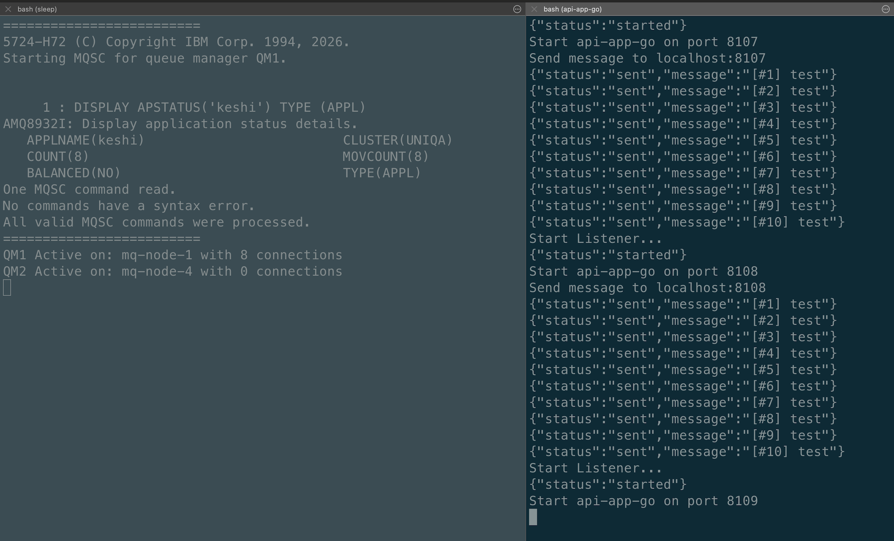
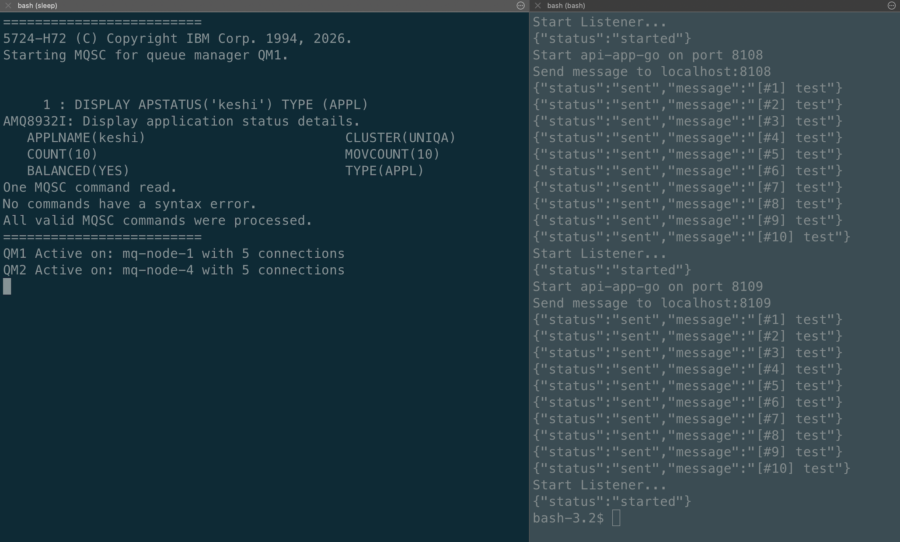

# IBM MQ Native HA with Uniform Cluster

IBM MQ **Uniform Cluster** extends Native HA by grouping two or more HA pairs into a single logical cluster. Each HA group runs as an independent queue manager, and the cluster layer distributes client connections and workload evenly across all active nodes. A client connecting to any node in the cluster is automatically rebalanced if the cluster becomes uneven.

## Table of Contents

- [IBM MQ Native HA with Uniform Cluster](#ibm-mq-native-ha-with-uniform-cluster)
  - [Table of Contents](#table-of-contents)
  - [Architecture](#architecture)
  - [MQ Configuration](#mq-configuration)
    - [Prerequisites](#prerequisites)
    - [Quick Start (Automated)](#quick-start-automated)
    - [Create Network and Volumes](#create-network-and-volumes)
    - [Create Secrets](#create-secrets)
    - [Node Configuration](#node-configuration)
    - [Start Containers](#start-containers)
    - [Verify the Cluster](#verify-the-cluster)
    - [CCDT (Client Channel Definition Table)](#ccdt-client-channel-definition-table)
  - [Test Applications](#test-applications)
    - [All-in-one Java Application](#all-in-one-java-application)
    - [Golang REST API](#golang-rest-api)
    - [Golang JMS REST API](#golang-jms-rest-api)
  - [Failover Test](#failover-test)
    - [Scenario 1 — Single node failover within HA-GROUP-1](#scenario-1--single-node-failover-within-ha-group-1)
    - [Scenario 2 — Full HA-GROUP-1 loss (all 3 nodes stopped)](#scenario-2--full-ha-group-1-loss-all-3-nodes-stopped)
  - [Application Load Balancing](#application-load-balancing)
    - [Monitoring Scripts](#monitoring-scripts)
    - [Investigating Balancing Eligibility](#investigating-balancing-eligibility)
    - [Delivery mode and syncpoint (at-most-once vs at-least-once)](#delivery-mode-and-syncpoint-at-most-once-vs-at-least-once)
  - [References](#references)

---

## Architecture

```
                    +------------------------------------------+
                    |          Client Applications             |
                    |    Connects via CCDT (all 6 nodes)       |
                    |  127.0.0.1(1414–1419), QM: *UNIQA        |
                    +------------------------------------------+
                                        │
          ┌─────────────────────────────┴─────────────────────────────┐
          │  Uniform Cluster UNIQA                                    │
          │  (workload balanced across both HA groups)                │
          │                                                           │
          │      ┌──────────── HA-GROUP-1 (QM1) ─────────────┐        │
          │      │                                           │        │
          │      │  mq-node-1     mq-node-2     mq-node-3    │        │
          │      │  port: 1414    port: 1415    port: 1416   │        │
          │      │  (ACTIVE)      (Replica)     (Replica)    │        │
          │      │                                           │        │
          │      │  Raft replication ──────────────────────► │        │
          │      └───────────────────────────────────────────┘        │
          │                                                           │
          │      ┌──────────── HA-GROUP-2 (QM2) ─────────────┐        │
          │      │                                           │        │
          │      │  mq-node-4     mq-node-5     mq-node-6    │        │
          │      │  port: 1417    port: 1418    port: 1419   │        │
          │      │  (ACTIVE)      (Replica)     (Replica)    │        │
          │      │                                           │        │
          │      │  Raft replication ──────────────────────► │        │
          │      └───────────────────────────────────────────┘        │
          └───────────────────────────────────────────────────────────┘
```

> **Key difference from Native HA:** In a plain Native HA setup the client must reconnect to the *same* queue manager after failover. In a Uniform Cluster the client connects to the cluster name (`*UNIQA`) and the cluster redistributes connections across both HA groups dynamically.

---

## MQ Configuration

### Prerequisites

- [Podman](https://podman.io/) (or Docker) installed.
- On Apple Silicon (M-series), all `podman run` commands include `--platform linux/amd64` because IBM does not publish an arm64 MQ server container image — it is available only for `linux/amd64`, `linux/s390x`, and `linux/ppc64le`.

### Quick Start (Automated)

[`create-cluster.sh`](create-cluster.sh) automates the full setup in one command — it replaces the manual steps in [Create Network and Volumes](#create-network-and-volumes), [Start Containers](#start-containers), and [Verify the Cluster](#verify-the-cluster).

```bash
./create-cluster.sh
```

The script prefers a running Docker engine, then Podman. Override detection with
`CONTAINER_ENGINE=docker` or `CONTAINER_ENGINE=podman`. Podman uses the existing
`mqAdminPassword` and `mqAppPassword` secrets. Docker uses the disposable-demo
defaults `passw0rd`, which can be overridden with `MQ_ADMIN_PASSWORD` and
`MQ_APP_PASSWORD`.

What the script does, in order:

1. **Stops and removes** any existing `mq-node-1` … `mq-node-6` containers
2. **Recreates all six volumes** on a clean slate
3. **Starts all six containers** with the cluster configuration (nodes 1–3 → QM1, nodes 4–6 → QM2)
4. Waits **60 s** then shows `podman ps` to confirm all containers are running
5. Waits another **60 s** for QM1 Native HA leader election and prints the active node
6. Waits another **60 s** for QM2 Native HA leader election and prints the active node
7. Waits a final **60 s** then runs `DISPLAY CLUSQMGR(*)` on both QM1 and QM2 to confirm cluster membership

> The Podman secrets `mqAdminPassword` and `mqAppPassword` must already exist before running this script — see [Create Secrets](#create-secrets).

---

### Create Network and Volumes

Create a dedicated container network so all six nodes can resolve each other by hostname:

```bash
podman network create mq-ha-net
```

Create one persistent volume per node. The script removes existing volumes before re-creating them so you can re-run it on a clean slate:

```bash
for i in mq-node-1-data mq-node-2-data mq-node-3-data mq-node-4-data mq-node-5-data mq-node-6-data; do
  podman volume exists $i && podman volume rm $i
  podman volume create $i
done
```

### Create Secrets

Store the admin and application passwords as Podman secrets so they are never passed as plain-text environment variables:

```bash
printf "passw0rd" | podman secret create mqAdminPassword -
printf "passw0rd" | podman secret create mqAppPassword -
```

### Node Configuration

Each node requires a `native-ha.ini` file. The configuration is identical to a plain Native HA setup with one addition: an `AutoCluster` section that registers the node with the uniform cluster.

**Node 1** — [`mq-native-ha/config/qm-node1-cluster.ini`](mq-native-ha/config/qm-node1-cluster.ini)

```ini
NativeHALocalInstance:
  Name=node-1
  GroupName=HA-GROUP-1

NativeHAInstance:
  Name=node-1
  ReplicationAddress=mq-node-1(4444)

NativeHAInstance:
  Name=node-2
  ReplicationAddress=mq-node-2(4444)

NativeHAInstance:
  Name=node-3
  ReplicationAddress=mq-node-3(4444)

AutoCluster:
  ClusterName=UNIQA
  Type=Uniform
  Repository1Name=QM1
  Repository1Conname=mq-node-1(1414),mq-node-2(1414),mq-node-3(1414)
  Repository2Name=QM2
  Repository2Conname=mq-node-4(1414),mq-node-5(1414),mq-node-6(1414)

Variables:
  CONNAME=mq-node-1(1414)
```

Nodes 2 and 3 have the same `AutoCluster` block — only `NativeHALocalInstance.Name` and `Variables.CONNAME` differ. Nodes 4–6 belong to `HA-GROUP-2` and use `QM2` as the queue manager name.

| Component        | File                                                                                               |
|------------------|----------------------------------------------------------------------------------------------------|
| MQSC             | [`mq-native-ha/config/config.cluster.mqsc`](mq-native-ha/config/config.cluster.mqsc)              |
| Node 1 (QM1)     | [`mq-native-ha/config/qm-node1-cluster.ini`](mq-native-ha/config/qm-node1-cluster.ini)            |
| Node 2 (QM1)     | [`mq-native-ha/config/qm-node2-cluster.ini`](mq-native-ha/config/qm-node2-cluster.ini)            |
| Node 3 (QM1)     | [`mq-native-ha/config/qm-node3-cluster.ini`](mq-native-ha/config/qm-node3-cluster.ini)            |
| Node 4 (QM2)     | [`mq-native-ha/config/qm-node4-cluster.ini`](mq-native-ha/config/qm-node4-cluster.ini)            |
| Node 5 (QM2)     | [`mq-native-ha/config/qm-node5-cluster.ini`](mq-native-ha/config/qm-node5-cluster.ini)            |
| Node 6 (QM2)     | [`mq-native-ha/config/qm-node6-cluster.ini`](mq-native-ha/config/qm-node6-cluster.ini)            |

### Start Containers

The loop increments ports automatically: nodes 1–3 use `1414–1416` (QM1), nodes 4–6 use `1417–1419` (QM2).

```bash
TAG=10.0.0.0-r1-amd64
MQ_PORT=1414
MQ_PROMETHEUS_PORT=9517
MQ_CONSOLE_PORT=9443
QUEUE_MANAGER=QM1

for i in 1 2 3 4 5 6; do
  if [ $i -gt 3 ]; then
    QUEUE_MANAGER=QM2
  fi
  echo "Creating Node $i ..."
  podman run -d \
    --secret mqAdminPassword --secret mqAppPassword \
    --name mq-node-$i \
    --platform linux/amd64 \
    --network mq-ha-net \
    --hostname mq-node-$i \
    -p $MQ_PORT:1414 \
    -p $MQ_CONSOLE_PORT:9443 \
    -p $MQ_PROMETHEUS_PORT:9517 \
    -v mq-node-$i-data:/var/mqm \
    -v ./mq-native-ha/config/qm-node$i-cluster.ini:/etc/mqm/native-ha.ini:ro \
    -v ./mq-native-ha/config/config.cluster.mqsc:/etc/mqm/config.mqsc:ro \
    -e LICENSE=accept \
    -e MQ_QMGR_NAME=$QUEUE_MANAGER \
    -e MQ_NATIVE_HA=true \
    -e MQ_ENABLE_EMBEDDED_WEB_SERVER=true \
    -e MQ_ENABLE_METRICS=true \
    icr.io/ibm-messaging/mq:$TAG
  MQ_PORT=$((MQ_PORT + 1))
  MQ_PROMETHEUS_PORT=$((MQ_PROMETHEUS_PORT + 1))
  MQ_CONSOLE_PORT=$((MQ_CONSOLE_PORT + 1))
done
```

Port mapping summary:

| Node | Queue Manager | MQ Port | Web Console | Prometheus |
|------|--------------|---------|-------------|------------|
| mq-node-1 | QM1 | 1414 | 9443 | 9517 |
| mq-node-2 | QM1 | 1415 | 9444 | 9518 |
| mq-node-3 | QM1 | 1416 | 9445 | 9519 |
| mq-node-4 | QM2 | 1417 | 9446 | 9520 |
| mq-node-5 | QM2 | 1418 | 9447 | 9521 |
| mq-node-6 | QM2 | 1419 | 9448 | 9522 |

### Verify the Cluster

**Check all containers are running:**

```bash
podman ps --format "table {{.Names}}\t{{.Ports}}\t{{.Status}}"
```

Expected output:

```
NAMES       PORTS                                                                                          STATUS
mq-node-1   0.0.0.0:1414->1414/tcp, 0.0.0.0:9443->9443/tcp, 0.0.0.0:9517->9517/tcp, 9157/tcp, 9415/tcp  Up 45 seconds
mq-node-2   0.0.0.0:1415->1414/tcp, 0.0.0.0:9444->9443/tcp, 0.0.0.0:9518->9517/tcp, 9157/tcp, 9415/tcp  Up 43 seconds
mq-node-3   0.0.0.0:1416->1414/tcp, 0.0.0.0:9445->9443/tcp, 0.0.0.0:9519->9517/tcp, 9157/tcp, 9415/tcp  Up 40 seconds
mq-node-4   0.0.0.0:1417->1414/tcp, 0.0.0.0:9446->9443/tcp, 0.0.0.0:9520->9517/tcp, 9157/tcp, 9415/tcp  Up 38 seconds
mq-node-5   0.0.0.0:1418->1414/tcp, 0.0.0.0:9447->9443/tcp, 0.0.0.0:9521->9517/tcp, 9157/tcp, 9415/tcp  Up 36 seconds
mq-node-6   0.0.0.0:1419->1414/tcp, 0.0.0.0:9448->9443/tcp, 0.0.0.0:9522->9517/tcp, 9157/tcp, 9415/tcp  Up 33 seconds
```

**Check Native HA status** — wait ~30 seconds for leader elections to complete:

```bash
podman exec mq-node-1 dspmq -o nativeha -x
podman exec mq-node-4 dspmq -o nativeha -x
```

QM1 (HA-GROUP-1):

```
QMNAME(QM1)       ROLE(Active)  INSTANCE(node-1) INSYNC(yes) QUORUM(3/3) GRPLSN(<0:0:17:6826>) GRPNAME(HA-GROUP-1) GRPROLE(Live)
 INSTANCE(node-1) ROLE(Active)  REPLADDR(mq-node-1) CONNACTV(yes) INSYNC(yes) BACKLOG(0) CONNINST(yes) ACKLSN(<0:0:17:6826>) HASTATUS(Normal)
 INSTANCE(node-2) ROLE(Replica) REPLADDR(mq-node-2) CONNACTV(yes) INSYNC(yes) BACKLOG(0) CONNINST(yes) ACKLSN(<0:0:17:6826>) HASTATUS(Normal)
 INSTANCE(node-3) ROLE(Replica) REPLADDR(mq-node-3) CONNACTV(yes) INSYNC(yes) BACKLOG(0) CONNINST(yes) ACKLSN(<0:0:17:6826>) HASTATUS(Normal)
```

QM2 (HA-GROUP-2):

```
QMNAME(QM2)       ROLE(Active)  INSTANCE(node-4) INSYNC(yes) QUORUM(3/3) GRPLSN(<0:0:12:52222>) GRPNAME(HA-GROUP-2) GRPROLE(Live)
 INSTANCE(node-4) ROLE(Active)  REPLADDR(mq-node-4) CONNACTV(yes) INSYNC(yes) BACKLOG(0) CONNINST(yes) ACKLSN(<0:0:12:52222>) HASTATUS(Normal)
 INSTANCE(node-5) ROLE(Replica) REPLADDR(mq-node-5) CONNACTV(yes) INSYNC(yes) BACKLOG(5) CONNINST(yes) ACKLSN(<0:0:12:52222>) HASTATUS(Normal)
 INSTANCE(node-6) ROLE(Replica) REPLADDR(mq-node-6) CONNACTV(yes) INSYNC(yes) BACKLOG(5) CONNINST(yes) ACKLSN(<0:0:12:52222>) HASTATUS(Normal)
```

**Check cluster membership** — both queue managers should see each other:

```bash
podman exec mq-node-1 bash -c "echo 'DISPLAY CLUSQMGR(*)' | runmqsc QM1"
podman exec mq-node-4 bash -c "echo 'DISPLAY CLUSQMGR(*)' | runmqsc QM2"
```

Expected output (same from both):

```
AMQ8441I: Display Cluster Queue Manager details.
   CLUSQMGR(QM1)   CHANNEL(UNIQA_QM1)   CLUSTER(UNIQA)
AMQ8441I: Display Cluster Queue Manager details.
   CLUSQMGR(QM2)   CHANNEL(UNIQA_QM2)   CLUSTER(UNIQA)
```

### CCDT (Client Channel Definition Table)

For a Uniform Cluster, **CCDT is the recommended connection method**. It lists all six node endpoints in a single file so the client can reach any node in the cluster regardless of which HA group is active.

**[`ccdt/ccdt.cluster.json`](ccdt/ccdt.cluster.json)** — covers all 6 nodes across both HA groups, queue manager `UNIQA`:

```json
{
  "channel": [
    {
      "name": "DEV.APP.SVRCONN",
      "clientConnection": {
        "connection": [
          {"host": "127.0.0.1", "port": 1414},
          {"host": "127.0.0.1", "port": 1415},
          {"host": "127.0.0.1", "port": 1416},
          {"host": "127.0.0.1", "port": 1417},
          {"host": "127.0.0.1", "port": 1418},
          {"host": "127.0.0.1", "port": 1419}
        ],
        "queueManager": "UNIQA"
      },
      "type": "clientConnection"
    },
    {
      "name": "DEV.APP.SVRCONN",
      "clientConnection": {
        "connection": [
          {"host": "127.0.0.1", "port": 1414},
          {"host": "127.0.0.1", "port": 1415},
          {"host": "127.0.0.1", "port": 1416}
        ],
        "queueManager": "QM1" 
      },
      "type": "clientConnection"
    },
    {
      "name": "DEV.APP.SVRCONN",
      "clientConnection": {
        "connection": [
          {"host": "127.0.0.1", "port": 1417},
          {"host": "127.0.0.1", "port": 1418},
          {"host": "127.0.0.1", "port": 1419}
        ],
        "queueManager": "QM2" 
      },
      "type": "clientConnection"
    }
  ]
}
```

> **`*UNIQA` vs `UNIQA`:**
> - **Java** (`all-in-one-app`): set `ibm.mq.queue-manager=*UNIQA`. The asterisk prefix is handled natively by the IBM MQ JMS client.
> - **Go** (`api-app-go`, `api-app-go-jms20`): set `IBM_MQ_QUEUE_MANAGER=*UNIQA`. The Go MQI C client also accepts the `*` prefix when a CCDT is used.
> - The CCDT file itself uses `queueManager: "UNIQA"` (no asterisk) as the cluster name for channel resolution.
>
> **Go CCDT path:** The Go MQI C library requires an **absolute** `file:///path` URL. A relative `file:../ccdt/...` silently fails and produces `MQRC_Q_MGR_NAME_ERROR (2058)`. Both Go apps call `resolveCcdtUrl()` which automatically converts any relative path to absolute.

---

## Test Applications

All applications connect to the Uniform Cluster using the **CCDT** file ([`ccdt/ccdt.cluster.json`](ccdt/ccdt.cluster.json)) and the queue manager name `*UNIQA` so the client accepts connections from either `QM1` or `QM2`. All three — the Java `all-in-one-app` and both Go apps — participate in application rebalancing; the MQI C client rebalances via `MQCNO_RECONNECT` + CCDT just like the Java JMS client.

### All-in-one Java Application

[`all-in-one-app`](all-in-one-app) is a Quarkus/JMS backend with a bundled Vue.js frontend.

**Configure CCDT** — [`application.properties`](all-in-one-app/src/main/resources/application.properties):

```properties
ibm.mq.ccdt-url=file:../ccdt/ccdt.cluster.json
#ibm.mq.connection-list=localhost(1414),localhost(1415),localhost(1416)
#ibm.mq.channel=DEV.APP.SVRCONN
ibm.mq.queue-manager=*UNIQA
```

> The path prefix `file:../ccdt/` is relative to the working directory when running from the project root via `mvn quarkus:dev`. Adjust the path when running from a different location or as a container.

**Build and run:**

```bash
cd all-in-one-app

# Run in dev mode (from all-in-one-app directory)
mvn quarkus:dev

# Or build and run from JAR (ccdt path relative to working directory)
mvn clean package
java -jar target/quarkus-app/quarkus-run.jar
```

Open [http://localhost:8080](http://localhost:8080) in a browser.

**Run as a container** — pull the published image
[`quay.io/voravitl/simple-mq-app`](https://quay.io/repository/voravitl/simple-mq-app) and mount the
CCDT for the selected engine. Podman uses
[`ccdt/ccdt.cluster.container.json`](ccdt/ccdt.cluster.container.json) with
`host.containers.internal`. Docker uses
[`ccdt/ccdt.cluster.docker.json`](ccdt/ccdt.cluster.docker.json), which resolves
the six MQ container names directly on `mq-ha-net`:

```bash
podman run -p 8080:8080 \
  -v ./ccdt/ccdt.cluster.container.json:/config/ccdt.json:ro \
  -e IBM_MQ_CCDT_URL="file:///config/ccdt.json" \
  -e IBM_MQ_QUEUE_MANAGER="*UNIQA" \
  -e IBM_MQ_APPLICATION_NAME="jack" \
  quay.io/voravitl/simple-mq-app:latest
```

```bash
docker run -p 8080:8080 --network mq-ha-net \
  -v ./ccdt/ccdt.cluster.docker.json:/config/ccdt.json:ro \
  -e IBM_MQ_CCDT_URL="file:///config/ccdt.json" \
  -e IBM_MQ_QUEUE_MANAGER="*UNIQA" \
  -e IBM_MQ_APPLICATION_NAME="jack" \
  quay.io/voravitl/simple-mq-app:latest
```

The Java consumer uses an async JMS `MessageListener` rather than a blocking
receive loop. The MQ JMS provider delivers messages on its own thread. Because
the client keeps a syncpoint GET armed for the next delivery, a snapshot usually
shows the connection as `INTRANS` / `MOVABLE(NO)` (see [Investigating Balancing
Eligibility](#investigating-balancing-eligibility)) — but that is **not** "stuck":
the queue manager's [`BALTIMEOUT`](https://www.ibm.com/docs/en/ibm-mq/9.4.x?topic=objects-baltimeout)
(balance timeout, default 10s) finds a movable **boundary** at each delivery to
complete a rebalance, so no polling interval or pulse tuning is required. (A
manual blocking `receive()` loop, by contrast, holds its GET across the whole
wait and does not present such a boundary, so it needs a periodic-receive
workaround to balance at all.)

> The earlier polling-loop implementation is preserved at the git tag
> [`all-in-one-loop`](#) for demo/comparison (`git checkout all-in-one-loop`).
> It uses `receiveNoWait()` on a pulse interval so the instance periodically
> becomes movable within `BALTIMEOUT`; the current `MessageListener` version is
> tagged `all-in-one-listener`.

Check balancing state with [`DISPLAY APSTATUS`](https://www.ibm.com/docs/en/ibm-mq/9.4.x?topic=reference-display-apstatus-display-application-status-multiplatforms):

```bash
echo "DIS APSTATUS('<appltag>') TYPE(APPL)" | runmqsc <qmgr>   # watch BALANCED / MOVCOUNT
```

The listener solves the *movable-window* half of balancing. The other half is
**reconnect**: the cluster rebalances by moving a connection to a different
queue manager, which requires the any-QM `MQCNO_RECONNECT`.

| Option | Reconnects to | Native HA | Uniform Cluster |
|---|---|---|---|
| `MQCNO_RECONNECT` | **any** QM in the CCDT / group | ✅ works | ✅ **required** |
| `MQCNO_RECONNECT_Q_MGR` | the **same** QM only | ✅ works | ❌ blocks the move |
| none / `MQCNO_RECONNECT_DISABLED` | — | ❌ manual reconnect only | ❌ not movable |

`MQCNO_RECONNECT_Q_MGR` pins the client to its current queue manager, so the
cluster can never move it — the instance shows as not movable. That is why the
demo apps connect to `*UNIQA` with the any-QM `MQCNO_RECONNECT` (the JMS apps set
`WMQ_CLIENT_RECONNECT` on the `ConnectionFactory`).

**Application log:**

- Use CCDT:
```log
2026-07-12 15:13:26,114 INFO  [com.example.config.MQConnectionFactoryProducer] (Quarkus Main Thread) Use CCDT: file:../ccdt/ccdt.cluster.json
```

- Connect to cluster (resolves to one of the active nodes):
```log
2026-07-12 15:13:55,047 DEBUG [com.example.resource.InfoResource] (executor-thread-1) Requesting MQ info — configured queueManager: *UNIQA
2026-07-12 15:13:55,093 DEBUG [com.example.resource.InfoResource] (executor-thread-1) MQ connection established successfully
2026-07-12 15:13:55,094 DEBUG [com.example.resource.InfoResource] (executor-thread-1) MQ Server Host: 127.0.0.1 (1414), resolvedQueueManager: QM1
2026-07-12 15:13:55,112 DEBUG [com.example.resource.InfoResource] (executor-thread-1) InfoResponse: connected=true, queueManager=QM1, host=127.0.0.1, port=1414
```

**Check application status on the cluster:**

Run on the active node of each HA group to see which group the client is connected to:

```bash
podman exec mq-node-1 bash -c "echo 'DISPLAY APSTATUS(*)' | runmqsc QM1"
podman exec mq-node-4 bash -c "echo 'DISPLAY APSTATUS(*)' | runmqsc QM2"
```

When the application is connected to `QM1`:

```
AMQ8932I: Display application status details.
   APPLNAME(all-in-one)                    CLUSTER(UNIQA)
   COUNT(1)                                MOVCOUNT(1)
   BALANCED(NO)                            TYPE(APPL)
```

> - `CLUSTER(UNIQA)` — confirms the connection is cluster-aware (compare to `CLUSTER( )` in a plain Native HA setup).
> - `MOVCOUNT(1)` — the cluster has moved this application connection once to balance load.
> - `BALANCED(NO)` — the cluster is still rebalancing; it becomes `YES` once load is distributed evenly.

---

### Golang REST API

[`api-app-go`](api-app-go) is a standalone Go REST API backend. Pair it with the [`ui-app`](ui-app) Vue.js frontend.

**Configure and run with CCDT:**

```bash
cd api-app-go
export IBM_MQ_CCDT_URL=file:../ccdt/ccdt.cluster.json
export IBM_MQ_QUEUE_MANAGER='*UNIQA'
./api-app-go
```

> `IBM_MQ_CCDT_URL` must be exported before running — it is not read from a config file. The Go app automatically resolves the relative `file:` path to an absolute `file:///...` form.

**Application log:**

- Use CCDT:
```log
2026/07/13 13:14:03 MQ connect: qmgr=*UNIQA ccdt=file:///Users/.../ccdt.cluster.json user=app
```

**Check application status:**

```bash
podman exec mq-node-1 bash -c "echo 'DISPLAY APSTATUS(*)' | runmqsc QM1"
podman exec mq-node-4 bash -c "echo 'DISPLAY APSTATUS(*)' | runmqsc QM2"
```

```
AMQ8932I: Display application status details.
   APPLNAME(API-APP-GO)                    CLUSTER(UNIQA)
   COUNT(1)                                MOVCOUNT(0)
   BALANCED(NO)                     TYPE(APPL)
```

---

### Golang JMS REST API

[`api-app-go-jms20`](api-app-go-jms20) is a Go REST API using the JMS20-style `mq-golang-jms20` library. Functionally identical to `api-app-go` at the MQ level — both use MQI C bindings underneath.

**Configure and run with CCDT:**

```bash
cd api-app-go-jms20
export IBM_MQ_CCDT_URL=file:../ccdt/ccdt.cluster.json
export IBM_MQ_QUEUE_MANAGER='*UNIQA'
./api-app-go-jms20
```

**Application log:**

- Use CCDT:
```log
2026/07/13 13:14:25 MQ connect: qmgr=*UNIQA ccdt=file:///Users/.../ccdt.cluster.json user=app
```

**Check application status:**

```bash
podman exec mq-node-1 bash -c "echo 'DISPLAY APSTATUS(*)' | runmqsc QM1"
podman exec mq-node-4 bash -c "echo 'DISPLAY APSTATUS(*)' | runmqsc QM2"
```

```
AMQ8932I: Display application status details.
   APPLNAME(API-APP-GO-JMS20)              CLUSTER(UNIQA)
   COUNT(1)                                MOVCOUNT(0)
   BALANCED(NO)                     TYPE(APPL)
```

---

## Failover Test

This walkthrough demonstrates two failure scenarios unique to a Uniform Cluster:

1. **HA group failover** — an active node within a group fails; one replica is promoted.
2. **Full HA group loss** — an entire HA group is stopped; clients rebalance to the surviving group.

### Scenario 1 — Single node failover within HA-GROUP-1

**1. Identify the active node in HA-GROUP-1:**

```bash
podman exec mq-node-1 dspmq -o nativeha -x
```

**2. Stop the active node** (replace `mq-node-1` with whichever node shows `ROLE(Active)`):

```bash
podman stop mq-node-1
```

**3. Observe automatic reconnection** — the MQ client reconnects to the new active node in HA-GROUP-1 within seconds. The application stays connected to QM1.

**4. Bring the stopped node back online:**

```bash
podman start mq-node-1
```

The recovered node rejoins HA-GROUP-1 as a replica and begins log replication catch-up.

### Scenario 2 — Full HA-GROUP-1 loss (all 3 nodes stopped)

**1. Stop all nodes in HA-GROUP-1:**

```bash
podman stop mq-node-1 mq-node-2 mq-node-3
```

**2. Observe cluster rebalancing** — the uniform cluster detects that `QM1` is unavailable and moves all client connections to `QM2`. The `APSTATUS` output on `QM2` will now show the `all-in-one` application:

```bash
podman exec mq-node-4 bash -c "echo 'DISPLAY APSTATUS(*)' | runmqsc QM2"
```

```
AMQ8932I: Display application status details.
   APPLNAME(all-in-one)                    CLUSTER(UNIQA)
   COUNT(1)                                MOVCOUNT(1)
   BALANCED(YES)
```

**3. Restore HA-GROUP-1:**

```bash
podman start mq-node-1 mq-node-2 mq-node-3
```

Once `QM1` is back, the cluster rebalances connections across both groups again. `BALANCED` returns to `NO` briefly during rebalancing, then settles to `YES`.

## Application Load Balancing

This walkthrough demonstrates how a Uniform Cluster distributes application workload across queue managers.

**1. Start Script for check balancing status**

Open a terminal and run from the repository root:

```bash
./check-app-balancing-status.sh <appltag>
```

> The `<appltag>` value depends on which test app you use:
> - Java all-in-one-app → `jack`
> - Golang app → `keshi`

**2. Start Test Apps**

Open another terminal and run from the repository root.

*Golang app* — starts 10 `api-app-go` instances on ports 8100–8109:
```bash
./start-go-lang-apps.sh
```

*Java all-in-one-app (JVM)* — starts 10 Quarkus instances on ports 9090–9099:
```bash
./start-all-in-one-apps.sh
```

*Java all-in-one-app (containers)* — starts 10 `all-in-one-app` containers on ports 9190–9199
from the published image [`quay.io/voravitl/simple-mq-app`](https://quay.io/repository/voravitl/simple-mq-app):
```bash
./start-all-in-one-apps-container.sh
```

The `start-go-lang-apps.sh` and `start-all-in-one-apps.sh` scripts:
- Start 10 instances in background mode
- Send 10 messages to each instance
- Start the message listener on each instance
- Write logs to the `logs/` directory

[`start-all-in-one-apps-container.sh`](start-all-in-one-apps-container.sh) does the same put/consume
test, but each instance runs in its own container (capped at 500 MB). It detects
Docker or Podman and selects the matching CCDT, sets
`IBM_MQ_QUEUE_MANAGER=*UNIQA`, and uses application tag `jack` — so it shows up
under the same `jack` tag in `check-app-balancing-status.sh`. Set
`APP_INSTANCE_COUNT=5` to mirror a five-replica deployment.

Each Quarkus container can contribute two long-lived JMS application instances:
one for the outbound SmallRye JMS connector after its first send and one after
the consumer is started. Therefore five containers can correctly appear as
`COUNT(10)` in `APSTATUS`; `CONNS(2)` is the pair of underlying MQ connections
grouped into each one of those JMS application instances.

> **What is an HCONN?** Those "underlying MQ connections" are *connection handles*.
> When any program connects to a queue manager it calls
> [`MQCONN`/`MQCONNX`](https://www.ibm.com/docs/en/ibm-mq/9.4.x?topic=calls-mqconn-connect-queue-manager),
> which returns an [`Hconn`](https://www.ibm.com/docs/en/ibm-mq/9.4.x?topic=fields-hconn-mqhconn)
> of type `MQHCONN` — the handle it must then pass to every later call (`MQOPEN`,
> `MQPUT`, `MQGET`, `MQCMIT`, `MQDISC`). One HCONN = one logical connection, and it is
> the row unit that `DIS CONN(*)` reports.
>
> JMS builds on this: each JMS `Connection` is one HCONN and its `Session` is another,
> so **one JMS Connection + Session = 2 HCONNs**. Each app opens two JMS Connections —
> the SmallRye JMS producer and the `MQConsumer` — giving **4 HCONNs per app**. Six apps
> therefore show `24` rows in `DIS CONN(*)`, while `APSTATUS COUNT` groups them into
> `12` *application instances* (it counts JMS connections, not raw handles). Different
> numbers, same connections — `DIS CONN` counts handles, `APSTATUS` counts instances.

**3. Check App Status**

`BALANCED(NO)` is expected immediately after startup while the cluster is still distributing connections.



It transitions to `YES` once all 10 application instances have settled evenly across both queue managers.




**4. Cleanup**

*Golang app* — run [clear-go-lang-apps.sh](clear-go-lang-apps.sh) to stop all `api-app-go` processes and remove log files:

```bash
./clear-go-lang-apps.sh
```

*Java all-in-one-app* — run [clear-all-in-one-apps.sh](clear-all-in-one-apps.sh) to stop all Quarkus processes and remove log files:

```bash
./clear-all-in-one-apps.sh
```

**5. [Optional] Bash Scripts**
- MQSC command check Application Status
  
  ```bash
  DISPLAY APSTATUS('<appltag>') TYPE(APPL)
  ```

  Run with podman exec (replace `jack` / `keshi` with your application tag)

  ```bash
  APPLTAG=jack
  podman exec "$QM1_ACTIVE_NODE" \
      bash -c "echo \"DISPLAY APSTATUS('$APPLTAG') TYPE(APPL)\" | runmqsc QM1"
  ```

- MQSC command to check connections

  ```bash
  DISPLAY conn(*) where(appltag eq '<appltag>') conntag
  ```

  Run with bash shell to count number of connections

  ```bash
  APPLTAG=jack   # or keshi for the Golang app
  QM1_ACTIVE_NODE=$(podman exec mq-node-1 dspmq -o nativeha -x \
      | grep "ROLE(Active)" | grep -v QMNAME \
      | awk '{print $3}' \
      | sed -r 's/^[^(]*\(([^)]+)\).*/\1/')
  QM1_CONN=$(podman exec "$QM1_ACTIVE_NODE" \
      bash -c "echo \"dis conn(*) where(appltag eq '$APPLTAG') conntag\" | runmqsc QM1" \
      | grep -c "APPLTAG")
  ```

### Monitoring Scripts

Three scripts poll `APSTATUS` and count connections in a loop (`clear` + `sleep`,
Ctrl-C to stop). All resolve the **Active** Native HA instance per queue manager
first, since a QM only accepts connections on its Active node. Pick by where MQ runs
and whether you can reach both queue managers from one place:

| Script | MQ runs as | Talks to | Use when |
|---|---|---|---|
| [`check-app-balancing-status.sh`](check-app-balancing-status.sh) | Docker/Podman containers | Both QMs (execs into each node) | Local container demo |
| [`check-app-balancing-status-vm.sh`](check-app-balancing-status-vm.sh) | Native on a VM | Both QMs, local `runmqsc` (bindings) | One VM can reach both QMs |
| [`check-app-balancing-status-vm-single.sh`](check-app-balancing-status-vm-single.sh) | Native on a VM | One QM only | ssh between VMs blocked — run on each MQ VM |

```bash
# Containers — appltag is the only argument
./check-app-balancing-status.sh jack

# VM, both QMs (defaults to QM1 QM2 if omitted); override poll interval
INTERVAL=3 ./check-app-balancing-status-vm.sh keshi QM1 QM2

# VM, single QM — run one per MQ VM (note arg order: qmgr first, then appltag)
./check-app-balancing-status-vm-single.sh QM1 keshi
```

**`SHOW_LOCAL` environment variable** (all three scripts): by default each script
prints the cluster summary (`COUNT`, `BALANCED`, `BALSTATE`) and connection counts.
Set `SHOW_LOCAL=1` to also run `DISPLAY APSTATUS(...) TYPE(LOCAL) MOVABLE IMMREASN`
on each QM and print the per-instance `MOVABLE` / `IMMREASN` — the eligibility detail
used in [Investigating Balancing Eligibility](#investigating-balancing-eligibility)
below.

```bash
SHOW_LOCAL=1 ./check-app-balancing-status.sh jack
SHOW_LOCAL=1 ./check-app-balancing-status-vm.sh keshi QM1 QM2
SHOW_LOCAL=1 ./check-app-balancing-status-vm-single.sh QM1 keshi
```

### Investigating Balancing Eligibility

`BALANCED` reflects the cluster's view **over time**; `MOVABLE` / `IMMREASN` is an
**instantaneous snapshot**. An instance showing `MOVABLE(NO)` right now does **not**
mean it can never balance — the uniform cluster relocates instances at message /
transaction boundaries, so a healthy cluster reaches an even split even while most
instances read `MOVABLE(NO)` in any single snapshot.

Real example — 16 instances fully balanced (`BALANCED(YES)`, 8 per queue manager)
while 7 of 8 instances on QM2 were `MOVABLE(NO)` at that instant:

```
=== Cluster summary (jack) ===
Cluster UNIQA   count=16  movcount=11  balanced=YES

QMgr  Count  MovCount  BalState  Active  LastMsg
----  -----  --------  --------  ------  -------------------
QM1   8      3         OK        YES     2026-08-03 04.00.20
QM2   8      8         OK        YES     2026-08-03 03.59.43

=== QM2 local eligibility ===   (7 of 8 not movable, yet balanced)
   IMMREASN(INTRANS)  MOVABLE(NO)    x7
   IMMREASN(NONE)     MOVABLE(YES)   x1
```

> `MovCount` is the `MOVCOUNT` field — the cluster's over-time movability tally, **not**
> the instantaneous `MOVABLE` flag. Here QM2 reads `MovCount 8` while 7 of its 8 instances
> show `MOVABLE(NO)` in the snapshot below: the two are different views, which is exactly
> the point of this section.

So don't read a snapshot full of `MOVABLE(NO)` as "stuck" — check `BALANCED` and the
per-QM `COUNT` instead. If connections really are pinned to one queue manager and
never move, the cause is almost always the **cluster itself** (a queue manager not
joined, wrong channel/CCDT), not the application.

**The `APSTATUS` hierarchy — three zoom levels.** [`DISPLAY APSTATUS`](https://www.ibm.com/docs/en/ibm-mq/9.4.x?topic=reference-display-apstatus-display-application-status-multiplatforms)
takes a `TYPE` that selects how far down you drill, from the whole cluster to a single queue
manager's instances:

| `TYPE` | Scope | Answers | Key fields |
|---|---|---|---|
| `TYPE(APPL)` | **Cluster-wide** roll-up | Is this app balanced across the cluster? | `COUNT`, `MOVCOUNT`, `BALANCED` |
| `TYPE(QMGR)` | **Per queue manager** | How many instances sit on each QM? | `QMNAME`, `COUNT`, `MOVCOUNT`, `BALSTATE` |
| `TYPE(LOCAL)` | **Instances on the QM you query** | Why is each local instance movable or not? | `MOVABLE`, `IMMREASN`, `CONNTAG` |

> All three are reported by the queue manager you run the command against. `TYPE(APPL)` is a
> genuine cluster-wide aggregate (any QM answers it identically); `TYPE(QMGR)` and `TYPE(LOCAL)`
> report only what that QM knows about its own instances.

Below `APSTATUS` sits [`DISPLAY CONN`](https://www.ibm.com/docs/en/ibm-mq/9.4.x?topic=reference-display-conn-display-connection-information),
a **different command** that inspects the physical connection (channel, open handles, in-flight
UOW) rather than balancing state. The bridge between them is `CONNTAG`: `TYPE(LOCAL)` gives you a
connection's `CONNTAG`, which you feed into `DIS CONN` to diagnose that one connection:

```bash
# APSTATUS TYPE(LOCAL) surfaces the CONNTAG; drill into that single connection with DIS CONN:
echo "DIS CONN(*) TYPE(CONN) WHERE(CONNTAG EQ 'MQCT...QM1_2026-08-06_12.26.42jack') ALL" | runmqsc QM1
```

> `TYPE(CONN)` is the default for `DIS CONN`; use `TYPE(HANDLE)` to list the queues/objects that
> connection has open, or `TYPE(*)` for both. One `CONNTAG` matches one physical connection — but
> a single app instance opening multiple connections shares the tag, so several `CONN(...)` rows
> back is expected.

So the full drill-down is **APPL → QMGR → LOCAL** (balancing view via `APSTATUS`), then
**`DIS CONN` by `CONNTAG`** for per-connection diagnostics. The commands below walk exactly that path.

**Commands to investigate, from broad to specific:**

```bash
# 1. Cluster-wide: is it balanced? how many instances per QM?
echo "DIS APSTATUS('jack') TYPE(APPL)" | runmqsc QM1

# 2. Per-instance eligibility on one QM — why is each instance movable or not?
echo "DIS APSTATUS('jack') TYPE(LOCAL) MOVABLE IMMREASN" | runmqsc QM1

# 3. Which HCONNs hold an open unit of work (UOWSTATE ACTIVE = INTRANS)?
echo "DIS CONN(*) WHERE(APPLTAG EQ 'jack') UOWSTATE CHANNEL CONNAME" | runmqsc QM1

# 4. Which of those conns are consumers vs producers?
#    MQOO_INPUT* = consumer, MQOO_OUTPUT = producer
echo "DIS CONN(*) WHERE(APPLTAG EQ 'jack') TYPE(HANDLE) OBJNAME OPENOPTS" | runmqsc QM1

# 5. Confirm the queue is really drained (idle) — no messages, none uncommitted
echo "DIS QSTATUS(DEV.DEMO.QL.IN) CURDEPTH UNCOM" | runmqsc QM1
```

**Reading `UOWSTATE` (connection view) and `CURDEPTH` / `UNCOM` (queue view).**
These two commands look at the same unit of work from opposite ends — the connection
that owns it, and the queue it touches.

[`DIS CONN … UOWSTATE`](https://www.ibm.com/docs/en/ibm-mq/9.4.x?topic=reference-display-conn-display-connection-information)
reports whether that HCONN currently has an in-flight transaction:

| `UOWSTATE` | Meaning |
|---|---|
| `NONE` | No open unit of work — the connection is at a boundary (committed). Movable. |
| `ACTIVE` | An uncommitted unit of work is open on this HCONN — a `GET`/`PUT` under syncpoint awaits `commit()`/`rollback()`. Shows as `IMMREASN(INTRANS) MOVABLE(NO)`. |

[`DIS QSTATUS(DEV.DEMO.QL.IN) CURDEPTH UNCOM`](https://www.ibm.com/docs/en/ibm-mq/9.4.x?topic=reference-display-qstatus-display-queue-status)
reports the same work from the queue's side:

| Field | Meaning |
|---|---|
| `CURDEPTH` | Messages currently on the queue (committed **and** uncommitted are counted). |
| `UNCOM(YES)` | At least one **uncommitted** change exists under syncpoint on this queue — an in-flight `GET` (transacted consume, not yet committed) or `PUT` (not yet committed). |
| `UNCOM(NO)` | No pending syncpoint work — everything on the queue is committed. |

**How they line up.** A transacted consume removes the message from the queue *provisionally*:
until `commit()`, the connection reads `UOWSTATE(ACTIVE)` and the queue reads `UNCOM(YES)`. On
`commit()` the message is gone for good and both clear (`NONE` / `UNCOM(NO)`); on `rollback()` (or
a crash) the message returns to the queue and is redelivered — this is the at-least-once guarantee
transacted mode buys.

```bash
# Correlate both views for the workload tag:
echo "DIS CONN(*) WHERE(APPLTAG EQ 'jack') UOWSTATE"     | runmqsc QM1   # ACTIVE = open UOW
echo "DIS QSTATUS(DEV.DEMO.QL.IN) CURDEPTH UNCOM"        | runmqsc QM1   # UNCOM(YES) = pending
```

> **Caveat — this does not prove `transacted=true`.** The Java async listener uses a syncpoint GET
> even in the default `AUTO_ACKNOWLEDGE` mode, so `UOWSTATE(ACTIVE)` and `IMMREASN(INTRANS)` appear
> either way. The difference is *duration*: committing per message (both auto-ack and the transacted
> consumer do) keeps the UOW open only briefly, so you rarely catch `UNCOM(YES)`. You only see
> `UNCOM(YES)` persist if a transaction batches several messages or stalls before committing.

**`IMMREASN` values seen in this demo:**

| `IMMREASN` | `MOVABLE` | Meaning |
|---|---|---|
| `NONE` | `YES` | At a boundary, ready to move. |
| `INTRANS` | `NO` | In a unit of work. The async JMS `MessageListener` keeps a syncpoint GET armed for the next delivery, so its consumer connection reads `INTRANS` **even when the queue is empty** (`CURDEPTH(0)`, `UNCOM(NO)`). This is normal and does **not** block balancing — the move happens at the next delivery boundary. |
| `NOTRECONN` | `NO` | Reconnect disabled on that connection, so the cluster can never move it. In this demo these are the one-shot `/api/info` probe connections (their factory sets `WMQ_CLIENT_RECONNECT_DISABLED`); they sit out of balancing by design. They connect under a **separate app name** (see below), so they no longer appear under the workload tag. |

**Probe connections use a separate app name.** The `/api/info` connectivity probe deliberately
disables client reconnect (it must fail fast, not retry a down queue manager), so its connections
are permanently `MOVABLE(NO) IMMREASN(NOTRECONN)`. If they shared the workload's application name
they would show up as permanently-unmovable rows under it and skew `MOVCOUNT` — making a healthy
app look partly stuck. To keep the balancing view clean, `probeConnectionFactory()` sets its
`WMQ_APPLICATIONNAME` to **`<app-name>-probe`** (e.g. `all-in-one` → `all-in-one-probe`), overriding
the base name applied to every factory. The workload and its probes are then separate APSTATUS apps:

```bash
# Workload only — no NOTRECONN noise:
echo "DIS APSTATUS('all-in-one') TYPE(APPL)"       | runmqsc QM1
# The probe connections, if you want to see them:
echo "DIS APSTATUS('all-in-one-probe') TYPE(APPL)" | runmqsc QM1
```

> `WMQ_APPLICATIONNAME` (the APSTATUS `APPLTAG`) caps at **28 characters** — keep the base
> `ibm.mq.application-name` short enough that the `-probe` suffix still fits.

### Delivery mode and syncpoint (at-most-once vs at-least-once)

Whether the consuming `MQGET` runs **under syncpoint** decides both the delivery guarantee
*and* how the instance appears in the tables above — it's the same knob:

| Consumer | `MQGET` | Delivery | `IMMREASN` snapshot |
|---|---|---|---|
| `api-app-go` (raw MQI) | `NO_SYNCPOINT` (fixed — no toggle) | **at-most-once** — message removed on get; lost if the app crashes before handling it | `NONE` / `MOVABLE(YES)` — no unit of work |
| `api-app-go-jms20`, default | `NO_SYNCPOINT` | **at-most-once** | `NONE` / `MOVABLE(YES)` — no unit of work |
| `api-app-go-jms20`, `IBM_MQ_TRANSACTED=true` | `SYNCPOINT` + explicit `Commit()` | **at-least-once** — stays on the queue until commit; a crash rolls back → redelivery | `INTRANS` while a message is in-flight; clears on commit |
| Java `all-in-one-app` async listener (default, `AUTO_ACKNOWLEDGE`) | internal syncpoint | **at-least-once** — auto-ack commits only *after* `onMessage()` returns successfully; a throw/crash mid-handling rolls back → redelivery | often `INTRANS` even when idle (armed GET) — still balances at delivery boundaries (see table above) |

**Which app can do at-least-once:**

| App | Default | At-least-once available? |
|---|---|---|
| `api-app-go` (raw MQI) | at-most-once | **No** — no syncpoint code, no toggle |
| `api-app-go-jms20` | at-most-once | **Yes** — set `IBM_MQ_TRANSACTED=true` |
| Java `all-in-one-app` | **at-least-once** (auto-ack) | Already on — redelivers on `onMessage` failure |

All balance in a healthy cluster — an `INTRANS` snapshot is not "stuck" (the move
happens at the next boundary within `BALTIMEOUT`). Transacted mode simply holds the unit of
work longer (until you commit), so a busy queue spends proportionally more time `INTRANS`.

**Enable transacted mode — Go `api-app-go-jms20`:**

```bash
export IBM_MQ_TRANSACTED=true    # default false
```

The consumer then opens a `JMSContextSESSIONTRANSACTED` context and calls `Commit()` after
each message is broadcast ([`mq/consumer.go`](api-app-go-jms20/mq/consumer.go)); committing
per message keeps the `INTRANS` window short.

**Java `all-in-one-app`** is non-transacted today — `createSession(false, AUTO_ACKNOWLEDGE)`
with no `commit()` — but it is **already at-least-once**: auto-ack commits the internal
syncpoint only after `onMessage()` returns successfully, so a failure redelivers. Switching to
`createSession(true, 0)` + `jmsSession.commit()` would **not** improve the delivery guarantee
here; it only earns its keep for batching several messages per commit or coordinating the get
with another resource (e.g. a DB write) in one unit of work — and it holds the instance
`INTRANS` longer until you commit.

**`api-app-go` (raw MQI) has no at-least-once option.** It gets with `NO_SYNCPOINT` and there
is no transacted toggle — the message is gone the instant `qObj.Get` returns. Only
`api-app-go-jms20` (via `IBM_MQ_TRANSACTED`) and the Java listener (via auto-ack) deliver
at-least-once.

> At-least-once means the broadcast side must tolerate **duplicate** deliveries. The default
> (non-transacted) mode suits this demo's fire-and-forget websocket fan-out.

## References

IBM MQ 9.4.x documentation:
- [CCDT (Client Channel Definition Table)](https://www.ibm.com/docs/en/ibm-mq/9.4.x?topic=tables-configuring-json-format-ccdt) — JSON format used by the client apps in this demo.
- [Automatic application balancing](https://www.ibm.com/docs/en/ibm-mq/9.4.x?topic=clusters-automatic-application-balancing) — how connections are moved to keep instances even.
- [`BALTIMEOUT` (balance timeout)](https://www.ibm.com/docs/en/ibm-mq/9.4.x?topic=objects-baltimeout) — grace period the QM waits for an instance to become movable; default 10s.
  
  >[Connection Factory Properties](https://www.ibm.com/docs/en/ibm-mq/9.4.x?topic=properties-connection-factory)
  >**NEVER**
  >The application never times out for the purposes of rebalancing in a uniform cluster.
  >This value maps to the IBM MQ BalancingOption MQBNO_TIMEOUT_NEVER.
  >
  >**IMMEDIATE**
  >The application immediately times out for the purposes of rebalancing in a uniform cluster.
  >This value maps to the IBM MQ BalancingOption MQBNO_TIMEOUT_IMMEDIATE.
  >
  >**DEFAULT**
  >The application times out for the purposes of rebalancing in a uniform cluster after the default period of 10 seconds.
  >This value maps to the IBM MQ BalancingOption MQBNO_TIMEOUT_AS_DEFAULT.
  >
  >**nn**
  >The application times out for the purposes of rebalancing in a uniform cluster after a period of nn seconds.
  >nn can be between 1 and 9999999999
  >
  > **Programmatic Access**
  
- [`DISPLAY APSTATUS`](https://www.ibm.com/docs/en/ibm-mq/9.4.x?topic=reference-display-apstatus-display-application-status-multiplatforms) — inspect `BALANCED` / `MOVCOUNT` per application.
<!-- - [`AutoCluster` stanza (qm.ini)](https://www.ibm.com/docs/en/ibm-mq/9.4.x?topic=file-autocluster-stanza-qmini) — the uniform-cluster configuration used in the node `qm.ini` files. -->

<!-- - [Native HA](https://www.ibm.com/docs/en/ibm-mq/9.4.x?topic=multiplatforms-native-ha) — Raft-based high availability groups. -->
<!-- - [Uniform clusters](https://www.ibm.com/docs/en/ibm-mq/9.4.x?topic=clusters-uniform) — automatic client connection balancing across queue managers. -->
