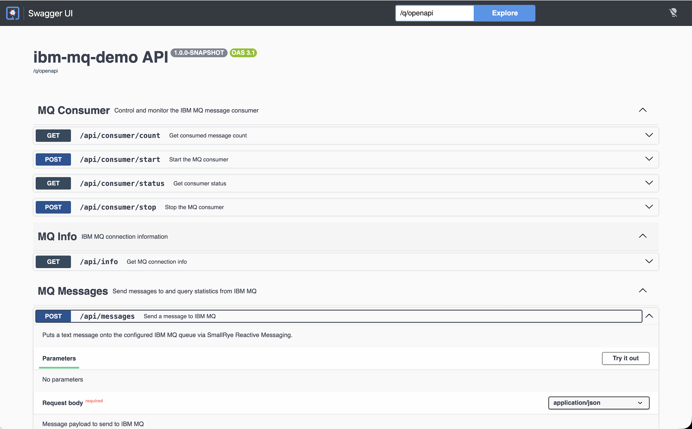
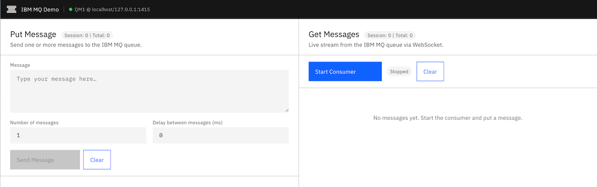
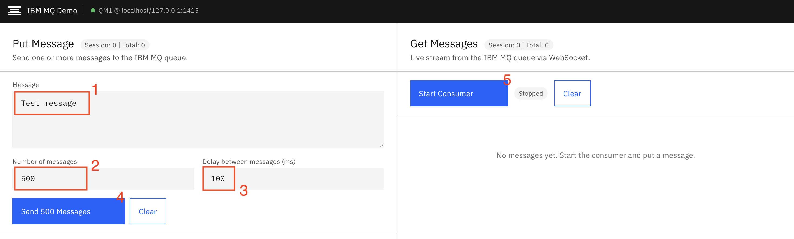
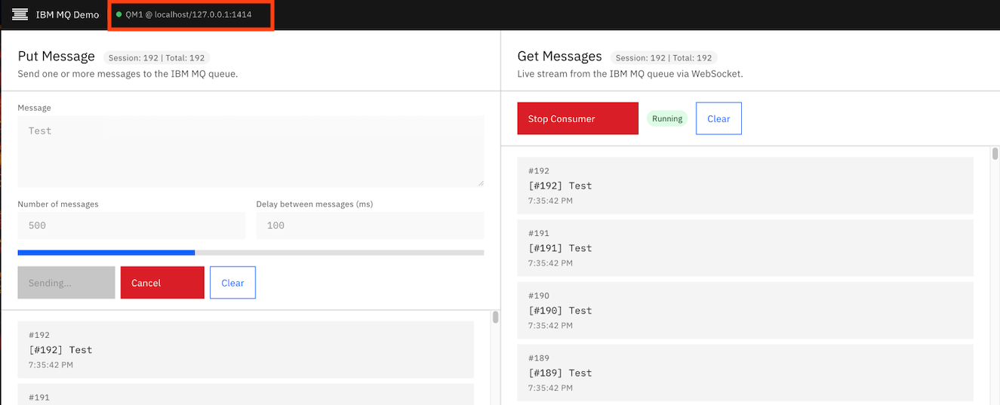
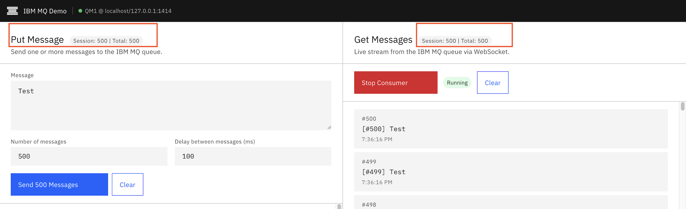

# IBM MQ Native HA

IBM MQ Native HA provides automatic failover across a three-node group using the Raft consensus protocol. One node is elected **Active** and serves all client connections; the other two are **Replicas** that receive continuous log replication. When the active node fails, one replica is promoted to active within seconds and clients reconnect automatically through the connection name list.

## Table of Contents

- [IBM MQ Native HA](#ibm-mq-native-ha)
  - [Table of Contents](#table-of-contents)
  - [Architecture](#architecture)
  - [MQ Configuration](#mq-configuration)
    - [Prerequisites](#prerequisites)
    - [Create Network and Volumes](#create-network-and-volumes)
    - [Create Secrets](#create-secrets)
    - [Native HA Node Configuration](#native-ha-node-configuration)
    - [Start Containers](#start-containers)
    - [Verify the Cluster](#verify-the-cluster)
  - [Test Applications](#test-applications)
    - [Connection List vs CCDT](#connection-list-vs-ccdt)
    - [The demo applications](#the-demo-applications)
      - [All-in-one Java Application](#all-in-one-java-application)
        - [Option A — Connection list (default)](#option-a--connection-list-default)
        - [Option B — CCDT](#option-b--ccdt)
        - [OpenAPI and Swagger UI](#openapi-and-swagger-ui)
      - [Golang REST API — `api-app-go` \& `api-app-go-jms20`](#golang-rest-api--api-app-go--api-app-go-jms20)
      - [UI app](#ui-app)
    - [Run apps as containers (Podman)](#run-apps-as-containers-podman)
      - [All-in-one app](#all-in-one-app)
      - [Go API](#go-api)
      - [UI app](#ui-app-1)
    - [Run apps as containers (Kubernetes)](#run-apps-as-containers-kubernetes)
      - [ConfigMap for config files](#configmap-for-config-files)
      - [Deployments \& Services](#deployments--services)
    - [Batch test with helper scripts](#batch-test-with-helper-scripts)
      - [Container batch test (all-in-one)](#container-batch-test-all-in-one)
      - [Native process batch test (Go)](#native-process-batch-test-go)
    - [Build and run from source](#build-and-run-from-source)
      - [Prerequisites — IBM MQ C client (Go)](#prerequisites--ibm-mq-c-client-go)
      - [All-in-one Java](#all-in-one-java)
      - [Go APIs](#go-apis)
      - [UI app](#ui-app-2)
    - [Application logic \& failure handling](#application-logic--failure-handling)
      - [Two-layer reconnect model](#two-layer-reconnect-model)
      - [Consumer](#consumer)
      - [Producer](#producer)
      - [Frontend retry \& counter](#frontend-retry--counter)
  - [Failover Test](#failover-test)

---

## Architecture

```
                    +------------------------------------------+
                    |          Client Applications             |
                    |   Connects via Connection Name List      |
                    |  localhost(1414),localhost(1415),        |
                    |             localhost(1416)              |
                    +------------------------------------------+
                                        │
            ┌───────────────────────────┼───────────────────────────┐
            │ (Active Traffic)          │                           │
            ▼                           ▼                           ▼
+────────────────────────+  +────────────────────────+  +────────────────────────+
│ Container: mq-node-1   │  │ Container: mq-node-2   │  │ Container: mq-node-3   │
│ MQ port:   1414        │  │ MQ port:   1415        │  │ MQ port:   1416        │
│ Web:       9443        │  │ Web:       9444        │  │ Web:       9445        │
│                        │  │                        │  │                        │
│  ┌──────────────────┐  │  │  ┌──────────────────┐  │  │  ┌──────────────────┐  │
│  │  Queue Manager   │  │  │  │  Queue Manager   │  │  │  │  Queue Manager   │  │
│  │    (ACTIVE)      │  │  │  │   (REPLICA)      │  │  │  │   (REPLICA)      │  │
│  └─────────┬────────┘  │  │  └─────────┬────────┘  │  │  └─────────┬────────┘  │
+────────────┼───────────+  +────────────┼───────────+  +────────────┼───────────+
             │                           ▲                           ▲
             │      Log Replication      │                           │
             └───────────────────────────┴───────────────────────────┘
                           (Raft Consensus Protocol, port 4444)
```

---

## MQ Configuration

### Prerequisites

- [Podman](https://podman.io/) (or Docker) installed.
- On Apple Silicon (M-series), all `podman run` commands include `--platform linux/amd64` because IBM does not publish an arm64 MQ server container image — it is available only for `linux/amd64`, `linux/s390x`, and `linux/ppc64le`.

### Create Network and Volumes

Create a dedicated container network so nodes can resolve each other by hostname:

```bash
podman network create mq-ha-net
```

Create one persistent volume per node. The script removes existing volumes before re-creating them so you can re-run it on a clean slate:

```bash
for i in mq-node-1-data mq-node-2-data mq-node-3-data; do
  podman volume exists $i && podman volume rm $i
  podman volume create $i
done
```

### Create Secrets

Store the admin and application passwords as Podman secrets so they are never passed as plain-text environment variables:

```bash
printf "passw0rd" | podman secret create mqAdminPassword -
printf "passw0rd" | podman secret create mqAppPassword -
```

### Native HA Node Configuration

Each node requires an `native-ha.ini` file that declares the local instance and the full membership list. All three files share the same `NativeHAInstance` list — only `NativeHALocalInstance.Name` differs.

**Node 1** — [`mq-native-ha/config/qm-node1.ini`](mq-native-ha/config/qm-node1.ini)

```ini
NativeHALocalInstance:
  Name=node-1
  GroupName=HA-GROUP-1

NativeHAInstance:
  Name=node-1
  ReplicationAddress=mq-node-1(4444)

NativeHAInstance:
  Name=node-2
  ReplicationAddress=mq-node-2(4444)

NativeHAInstance:
  Name=node-3
  ReplicationAddress=mq-node-3(4444)
```

The MQSC configuration ([`mq-native-ha/config/config.auth.mqsc`](mq-native-ha/config/config.auth.mqsc)) defines the channel, queues, channel authentication rules, and object authority records used by the demo applications.

| Component        | File                                                                           |
|------------------|--------------------------------------------------------------------------------|
| MQSC             | [`mq-native-ha/config/config.auth.mqsc`](mq-native-ha/config/config.auth.mqsc)|
| Native HA Node 1 | [`mq-native-ha/config/qm-node1.ini`](mq-native-ha/config/qm-node1.ini)        |
| Native HA Node 2 | [`mq-native-ha/config/qm-node2.ini`](mq-native-ha/config/qm-node2.ini)        |
| Native HA Node 3 | [`mq-native-ha/config/qm-node3.ini`](mq-native-ha/config/qm-node3.ini)        |

### Start Containers

Use [`create-nativeha.sh`](create-nativeha.sh) to start (or recreate) the three-node cluster in one step:

```bash
chmod +x create-nativeha.sh
./create-nativeha.sh
```

The script:
1. Stops and force-removes **all** running containers (`podman stop -a; podman rm -a -f`).
2. Removes and recreates the three named volumes (`mq-node-{1,2,3}-data`).
3. Starts all three MQ nodes in a loop, incrementing ports for each node:

| Node | MQ port | Web Console | Prometheus |
|------|---------|-------------|------------|
| mq-node-1 | 1414 | 9443 | 9517 |
| mq-node-2 | 1415 | 9444 | 9518 |
| mq-node-3 | 1416 | 9445 | 9519 |

4. Waits 60 seconds for the initial leader election, then prints the active node:

```
QM1 Active on: mq-node-2
```

> **Warning:** `podman stop -a` stops **every** container on the host, not only the MQ nodes. Use it only on a dedicated dev machine or Podman VM.

**Manual commands (reference):**

```bash
TAG=10.0.0.0-r1-amd64
CONFIG=config.auth.mqsc

# ── Node 1 ──────────────────────────────────────────────────────────────────
podman run -d \
  --secret mqAdminPassword --secret mqAppPassword \
  --name mq-node-1 \
  --platform linux/amd64 \
  --network mq-ha-net \
  --hostname mq-node-1 \
  -p 1414:1414 \
  -p 9443:9443 \
  -p 9517:9517 \
  -v mq-node-1-data:/var/mqm \
  -v ./mq-native-ha/config/qm-node1.ini:/etc/mqm/native-ha.ini:ro \
  -v ./mq-native-ha/config/$CONFIG:/etc/mqm/config.mqsc:ro \
  -e LICENSE=accept \
  -e MQ_QMGR_NAME=QM1 \
  -e MQ_NATIVE_HA=true \
  -e MQ_ENABLE_EMBEDDED_WEB_SERVER=true \
  -e MQ_ENABLE_METRICS=true \
  icr.io/ibm-messaging/mq:$TAG

# ── Node 2 ──────────────────────────────────────────────────────────────────
podman run -d \
  --secret mqAdminPassword --secret mqAppPassword \
  --name mq-node-2 \
  --platform linux/amd64 \
  --network mq-ha-net \
  --hostname mq-node-2 \
  -p 1415:1414 \
  -p 9444:9443 \
  -p 9518:9517 \
  -v mq-node-2-data:/var/mqm \
  -v ./mq-native-ha/config/qm-node2.ini:/etc/mqm/native-ha.ini:ro \
  -v ./mq-native-ha/config/$CONFIG:/etc/mqm/config.mqsc:ro \
  -e LICENSE=accept \
  -e MQ_QMGR_NAME=QM1 \
  -e MQ_NATIVE_HA=true \
  -e MQ_ENABLE_EMBEDDED_WEB_SERVER=true \
  -e MQ_ENABLE_METRICS=true \
  icr.io/ibm-messaging/mq:$TAG

# ── Node 3 ──────────────────────────────────────────────────────────────────
podman run -d \
  --secret mqAdminPassword --secret mqAppPassword \
  --name mq-node-3 \
  --platform linux/amd64 \
  --network mq-ha-net \
  --hostname mq-node-3 \
  -p 1416:1414 \
  -p 9445:9443 \
  -p 9519:9517 \
  -v mq-node-3-data:/var/mqm \
  -v ./mq-native-ha/config/qm-node3.ini:/etc/mqm/native-ha.ini:ro \
  -v ./mq-native-ha/config/$CONFIG:/etc/mqm/config.mqsc:ro \
  -e LICENSE=accept \
  -e MQ_QMGR_NAME=QM1 \
  -e MQ_NATIVE_HA=true \
  -e MQ_ENABLE_EMBEDDED_WEB_SERVER=true \
  -e MQ_ENABLE_METRICS=true \
  icr.io/ibm-messaging/mq:$TAG
```

### Verify the Cluster

**Check all containers are running:**

```bash
podman ps --format "table {{.Names}}\t{{.Ports}}\t{{.Status}}"
```

Expected output:

```
NAMES       PORTS                                                                               STATUS
mq-node-1   0.0.0.0:1414->1414/tcp, 0.0.0.0:9443->9443/tcp, 0.0.0.0:9517->9517/tcp            Up 14 seconds
mq-node-2   0.0.0.0:1415->1414/tcp, 0.0.0.0:9444->9443/tcp, 0.0.0.0:9518->9517/tcp            Up 12 seconds
mq-node-3   0.0.0.0:1416->1414/tcp, 0.0.0.0:9445->9443/tcp, 0.0.0.0:9519->9517/tcp            Up 10 seconds
```

**Check Native HA status** — wait ~30 seconds for the initial leader election to complete:

```bash
podman exec mq-node-1 dspmq -o nativeha -x
```

Expected output (active node may vary):

```
QMNAME(QM1)       ROLE(Replica) INSTANCE(node-1) INSYNC(yes) QUORUM(3/3) GRPLSN(<0:0:36:38367>) GRPNAME(HA-GROUP-1) GRPROLE(Live)
 INSTANCE(node-1) ROLE(Replica) REPLADDR(mq-node-1) CONNACTV(yes) INSYNC(yes) BACKLOG(0) CONNINST(yes) ACKLSN(<0:0:36:38367>) HASTATUS(Normal) SYNCTIME(2026-07-07T10:37:36.077777Z) ALTDATE(2026-07-07) ALTTIME(10.37.37)
 INSTANCE(node-2) ROLE(Active)  REPLADDR(mq-node-2) CONNACTV(yes) INSYNC(yes) BACKLOG(0) CONNINST(yes) ACKLSN(<0:0:36:38367>) HASTATUS(Normal) SYNCTIME(2026-07-07T10:37:37.430102Z) ALTDATE(2026-07-07) ALTTIME(10.37.37)
 INSTANCE(node-3) ROLE(Replica) REPLADDR(mq-node-3) CONNACTV(yes) INSYNC(yes) BACKLOG(0) CONNINST(yes) ACKLSN(<0:0:36:38367>) HASTATUS(Normal) SYNCTIME(2026-07-07T10:37:36.077777Z) ALTDATE(2026-07-07) ALTTIME(10.37.37)
```

> **Notes:**
> - `QUORUM(3/3)` — all three nodes are participating.
> - `node-2` is active in this example; `node-1` and `node-3` are replicas.
> - Reference: [dspmq command — IBM Docs](https://www.ibm.com/docs/en/ibm-mq/9.4.x?topic=reference-dspmq-display-queue-managers)
<!-- Displays operational information for an instance in a Native HA configuration. Used on its own, displays ROLE, INSTANCE, INSYNC, QUORUM, GRPLSN, GRPNAME, and GRPROLE fields. (see Table 2). Combine with the -x parameter to view additional information on all the instances in the Native HA configuration (see Table 4). Combine with the -g parameter to view information about Native HA groups (see Table 5) -->

**Confirm all MQ listener ports are reachable:**

```bash
nc -vz 127.0.0.1 1414
nc -vz 127.0.0.1 1415
nc -vz 127.0.0.1 1416
```

**Probe which node is active via the REST API** (useful when scripting a Layer 4 load-balancer health check):

```bash
ADMIN_USER=admin
ADMIN_PASS=passw0rd
QM_NAME=QM1

for PORT in 9443 9444 9445; do
  echo "=== port $PORT ==="
  curl -sk -u ${ADMIN_USER}:${ADMIN_PASS} \
    https://localhost:$PORT/ibmmq/rest/v1/admin/qmgr/$QM_NAME \
    | python3 -m json.tool 2>/dev/null || echo "(no response)"
done
```

Response from the **active** node:

```json
{
  "qmgr": [
    {
      "name": "QM1",
      "state": "running"
    }
  ]
}
```

Response from a **replica** node:

```json
{
  "error": [{
    "msgId": "MQWB0004E",
    "completionCode": 2,
    "reasonCode": 2543,
    "type": "pcf",
    "message": "MQWB0004E: An internal error occurred while communicating with the queue manager. The root MQ reason code was 2543 : MQRC_STANDBY_Q_MGR."
  }]
}
```

## Test Applications

Three demo apps exercise the Native HA group — a Java **all-in-one-app**, two Go REST APIs (**api-app-go** and **api-app-go-jms20**), and a Vue.js **ui-app**. All support two connection modes — **connection name list** (default) and **CCDT** — and enable automatic client reconnect so a failover is transparent to the application layer.

The flow below is: how a client finds MQ (connection list vs CCDT) → what each app is → run them as containers → batch test → build from source → how the reconnect/failure logic works.

### Connection List vs CCDT

A **Client Channel Definition Table (CCDT)** is a JSON file that describes the MQ channel and connection endpoints the client should use. It is an alternative to specifying `connectionList` and `channel` separately — the client reads both from the CCDT file instead.

| | Connection List | CCDT |
|---|---|---|
| Config location | App config / env vars | JSON file on disk (or URL) |
| Channel | Set separately | Embedded in the JSON |
| Multi-host | Comma-separated list | Array of `connection` objects |
| When to use | Simple setups, local dev | Production, shared config, uniform cluster |

Two CCDT files are provided in the [`ccdt/`](ccdt/) directory:

**[`ccdt/ccdt.nativeha.json`](ccdt/ccdt.nativeha.json)** — for Native HA (3 nodes, queue manager `QM1`):

```json
{
  "channel": [
    {
      "name": "DEV.APP.SVRCONN",
      "clientConnection": {
        "connection": [
          {"host": "127.0.0.1", "port": 1414},
          {"host": "127.0.0.1", "port": 1415},
          {"host": "127.0.0.1", "port": 1416}
        ],
        "queueManager": "QM1"
      },
      "type": "clientConnection"
    }
  ]
}
```

<!-- **[`ccdt/ccdt.cluster.json`](ccdt/ccdt.cluster.json)** — for Native HA + Uniform Cluster (6 nodes, queue manager `UNIQA`):

```json
{
  "channel": [
    {
      "name": "DEV.APP.SVRCONN",
      "clientConnection": {
        "connection": [
          {"host": "127.0.0.1", "port": 1414},
          {"host": "127.0.0.1", "port": 1415},
          {"host": "127.0.0.1", "port": 1416},
          {"host": "127.0.0.1", "port": 1417},
          {"host": "127.0.0.1", "port": 1418},
          {"host": "127.0.0.1", "port": 1419}
        ],
        "queueManager": "UNIQA"
      },
      "type": "clientConnection"
    }
  ]
}
``` -->

> **Note:** The `queueManager` field in the CCDT matches the queue manager the client connects to. Use `QM1` for Native HA and `UNIQA` (or `*UNIQA`) for a Uniform Cluster — the asterisk prefix tells the client to accept any queue manager whose name starts with `UNIQA`.

---

### The demo applications

This section covers **what each app is and how it picks its connection mode**. To actually run them, use [Run apps as containers (Podman)](#run-apps-as-containers-podman) (the primary path) or [Build and run from source](#build-and-run-from-source).

| App | Language / stack | Pairs with | MQ layer |
|-----|------------------|------------|----------|
| `all-in-one-app` | Java, Quarkus/JMS | bundled Vue.js UI | JMS (`MQConnectionFactory`) |
| `api-app-go` | Go | `ui-app` | raw `mq-golang/v5` (MQI) |
| `api-app-go-jms20` | Go | `ui-app` | `mq-golang-jms20` (JMS-style) |
| `ui-app` | Vue.js + nginx | either Go API | browser → REST / WebSocket |

#### All-in-one Java Application

[`all-in-one-app`](all-in-one-app) is a Quarkus/JMS backend with a bundled Vue.js frontend.

The app supports two connection modes — **connection list** (default) and **CCDT**. The mode is selected at startup based on whether `ibm.mq.ccdt-url` is set. If it is present and non-blank, CCDT is used; otherwise the connection list and channel are used.

##### Option A — Connection list (default)

[`application.properties`](all-in-one-app/src/main/resources/application.properties):

```properties
# ibm.mq.ccdt-url is commented out — connection list is active
ibm.mq.connection-list=localhost(1414),localhost(1415),localhost(1416)
ibm.mq.channel=DEV.APP.SVRCONN
ibm.mq.queue-manager=QM1
```

##### Option B — CCDT

uncomment `ibm.mq.ccdt-url` and comment out `connection-list` and `channel`:

```properties
ibm.mq.ccdt-url=file:ccdt/ccdt.nativeha.json
#ibm.mq.connection-list=localhost(1414),localhost(1415),localhost(1416)
#ibm.mq.channel=DEV.APP.SVRCONN
ibm.mq.queue-manager=QM1
```

> The CCDT file embeds the channel name and all connection endpoints, so `connection-list` and `channel` are ignored when `ccdt-url` is set.

**Connection factory** — [`MQConnectionFactoryProducer.java`](all-in-one-app/src/main/java/com/example/config/MQConnectionFactoryProducer.java):

```java
@ApplicationScoped
public class MQConnectionFactoryProducer {
    private static final Logger LOG = Logger.getLogger(MQConnectionFactoryProducer.class);

    @Inject
    MQConfig config;

    @Produces
    @ApplicationScoped
    public ConnectionFactory connectionFactory() throws JMSException {
        MQConnectionFactory factory = new MQConnectionFactory();

        // ccdtUrl() returns Optional<String> — present and non-blank means use CCDT
        String ccdtUrl = config.ccdtUrl().filter(s -> !s.isBlank()).orElse(null);
        if (ccdtUrl != null) {
            factory.setStringProperty(WMQConstants.WMQ_CCDTURL, ccdtUrl);
            LOG.info("Use CCDT: " + ccdtUrl);
        } else {
            factory.setConnectionNameList(config.connectionList());
            factory.setChannel(config.channel());
            LOG.info("Use Connection List: " + config.connectionList());
        }

        factory.setQueueManager(config.queueManager());
        factory.setIntProperty(WMQConstants.WMQ_CONNECTION_MODE, WMQConstants.WMQ_CM_CLIENT);
        factory.setStringProperty(WMQConstants.USERID, config.username());
        factory.setStringProperty(WMQConstants.PASSWORD, config.password());
        factory.setStringProperty(WMQConstants.WMQ_APPLICATIONNAME, config.applicationName());
        // WMQ_CLIENT_RECONNECT retries indefinitely across all hosts in the
        // connection name list (or CCDT) until the active node is found.
        // WMQ_CLIENT_RECONNECT_TIMEOUT caps each individual reconnect attempt
        // (ibm.mq.client-reconnect-timeout, default 5 s).
        factory.setIntProperty(WMQConstants.WMQ_CLIENT_RECONNECT_OPTIONS, WMQConstants.WMQ_CLIENT_RECONNECT);
        factory.setIntProperty(WMQConstants.WMQ_CLIENT_RECONNECT_TIMEOUT, config.clientReconnectTimeout());
        return factory;
    }
}
```

##### OpenAPI and Swagger UI

The REST API is fully documented with OpenAPI 3. Once the application is running:
You can access swagger-ui at /q/swagger-ui

| URL | Description |
|-----|-------------|
| [http://localhost:8080/q/swagger-ui](http://localhost:8080/q/swagger-ui) | Interactive Swagger UI |
| [http://localhost:8080/q/openapi](http://localhost:8080/q/openapi) | OpenAPI 3 spec (YAML) |
| [http://localhost:8080/q/openapi?format=json](http://localhost:8080/q/openapi?format=json) | OpenAPI 3 spec (JSON) |

The spec covers three tag groups:

| Tag | Endpoints |
|-----|-----------|
| **MQ Info** | `GET /api/info` — queue manager name, host, port, connection status |
| **MQ Consumer** | `POST /api/consumer/start`, `POST /api/consumer/stop`, `GET /api/consumer/status`, `GET /api/consumer/count` |
| **MQ Messages** | `POST /api/messages` (send), `GET /api/messages/count` |

Swagger-UI



#### Golang REST API — `api-app-go` & `api-app-go-jms20`

There are two interchangeable Go backends. Both expose identical REST endpoints, the same
message format, and the same WebSocket broadcast — they differ only in the MQ client layer.
Pair either with the [`ui-app`](ui-app) Vue.js frontend.

| | `api-app-go` | `api-app-go-jms20` |
|--|--|--|
| Library | `mq-golang/v5/ibmmq` (raw MQI) | `mq-golang-jms20` (JMS-style) |
| Send | `qObj.Put(md, pmo, bytes)` | `ctx.CreateProducer().SendString(dest, body)` |
| Receive | `qObj.Get(md, gmo, buf)` + MQRC 2033 check | `consumer.Receive(500)` — `nil` = no message |

Both listen on **http://localhost:8081** by default and read all MQ settings from environment variables.

**Configuration** — [`api-app-go/config/config.go`](api-app-go/config/config.go):

```go
func Load() *Config {
    return &Config{
        CcdtUrl:          getenv("IBM_MQ_CCDT_URL", ""),
        ConnectionList:   getenv("IBM_MQ_CONNECTION_LIST", "localhost(1414),localhost(1415),localhost(1416)"),
        Host:             getenv("IBM_MQ_HOST", "localhost"),
        Port:             getenvInt("IBM_MQ_PORT", 1414),
        AppName:          getenv("MQAPPLNAME", "API-APP-GO"),
        Channel:          getenv("IBM_MQ_CHANNEL", "DEV.APP.SVRCONN"),
        QueueManager:     getenv("IBM_MQ_QUEUE_MANAGER", "QM1"),
        Username:         getenv("IBM_MQ_USERNAME", "app"),
        Password:         getenv("IBM_MQ_PASSWORD", "passw0rd"),
        Queue:             getenv("IBM_MQ_QUEUE", "DEV.DEMO.QL.IN"),
        HeartbeatInterval: getenvInt("IBM_MQ_HEARTBEAT_INTERVAL", 5),
        ServerPort:        getenv("SERVER_PORT", "8081"),
    }
}
```

When `IBM_MQ_CCDT_URL` is set, it takes precedence over `IBM_MQ_CONNECTION_LIST` and `IBM_MQ_CHANNEL` — both channel name and connection endpoints are read from the CCDT file.

**Automatic reconnect (`api-app-go`)** — [`api-app-go/mq/connect.go`](api-app-go/mq/connect.go):

```go
cno.Options = ibmmq.MQCNO_CLIENT_BINDING |
    // MQCNO_RECONNECT: allows reconnect within a Native HA group (failover)
    // AND across queue managers in a Uniform Cluster (balancing).
    // MQCNO_RECONNECT_Q_MGR would block cross-QM balancing entirely.
    ibmmq.MQCNO_RECONNECT
```

`cd.HeartbeatInterval` (env `IBM_MQ_HEARTBEAT_INTERVAL`, default 5 s) is the **channel
heartbeat interval** — it governs how quickly a dead connection is *detected*, not a
reconnect timeout.

**Connection factory (`api-app-go-jms20`)** — [`api-app-go-jms20/mq/connect.go`](api-app-go-jms20/mq/connect.go).
`ConnectionFactoryImpl` only exposes a single `Hostname`+`PortNumber`, so an `MQOptions`
callback injects the full connection details and enables `MQCNO_RECONNECT` at connect time:

```go
func connectOption(cfg *config.Config) jms20subset.MQOptions {
    return func(cno *ibmmq.MQCNO) {
        cno.Options |= ibmmq.MQCNO_RECONNECT
        cno.ApplName = cfg.AppName

        if cfg.CcdtUrl != "" {
            // CCDT takes precedence — channel and connection list are read
            // from the CCDT file; no ConnectionName override is needed.
            cno.CCDTUrl = resolveCcdtUrl(cfg.CcdtUrl)
        } else {
            // Override ConnectionName with the full multi-host list.
            cno.ClientConn.ConnectionName = connectionName(cfg)
            cno.ClientConn.HeartbeatInterval = int32(cfg.HeartbeatInterval)
        }
    }
}
```

In both apps `MQCNO_RECONNECT` (not `MQCNO_RECONNECT_Q_MGR`) allows reconnect within a Native HA group **and** across queue managers in a Uniform Cluster; `_Q_MGR` would block cross-QM balancing entirely.

Reconnect must be enabled for automatic recovery; which flavor you pick matters:

| Option | Reconnects to | Native HA | Uniform Cluster |
|---|---|---|---|
| `MQCNO_RECONNECT` | **any** QM in the CCDT / group | ✅ works | ✅ **required** |
| `MQCNO_RECONNECT_Q_MGR` | the **same** QM only | ✅ works | ❌ blocks the move |
| none / `MQCNO_RECONNECT_DISABLED` | — | ❌ manual reconnect only | ❌ not movable |

- **Native HA:** either flavor works — after failover the *same* queue manager name is promoted onto a new active node, so even the same-QM variant reconnects successfully.
- **Uniform Cluster:** balancing moves a connection to a *different* queue manager, so it needs the any-QM `MQCNO_RECONNECT`. `_Q_MGR` pins the client to its current QM and prevents the rebalance (the instance shows as not movable).

> The JMS apps set the equivalent via `WMQ_CLIENT_RECONNECT` (any-QM) on the `ConnectionFactory` — see the [Two-layer reconnect model](#two-layer-reconnect-model).

The `api-app-go-jms20` consumer poll loop ([`consumer.go`](api-app-go-jms20/mq/consumer.go)) mirrors the raw variant — a 500 ms receive timeout, `nil`/`nil` meaning "no message":

```go
// 500ms receive timeout — mirrors jmsConsumer.receive(500) in MQConsumer.java.
// nil message with nil error means timeout expired (no message available).
msg, jmsErr := cons.Receive(500)
if jmsErr != nil { /* reconnectLoop() */ }
if msg == nil    { continue }           // timeout, no message
text := *msg.(jms20subset.TextMessage).GetText()
```

See [Application logic & failure handling](#application-logic--failure-handling) for how the producer and consumer behave during a failover.

#### UI app

The Vue.js frontend ([`ui-app`](ui-app)) is a separate Vite/nginx app. In dev it proxies `/api` and `/ws` to `http://localhost:8081`; as a container the backend URL is the runtime env var `API_UPSTREAM`. It talks only to the Go API over REST + WebSocket — it has no direct MQ connection, so it inherits whatever connection mode the API uses.

### Run apps as containers (Podman)

All three apps — **all-in-one**, **Go API** (`api-app-go` and `api-app-go-jms20`), and the **Vue.js UI** — have published container images. Run them with podman against the local Native HA group.

> **Architecture note:** Both Go API images are **linux/amd64** (IBM ships the MQ C client for LinuxX64 only)
> and segfault under QEMU — run on a native amd64 host, not Apple Silicon. Inside a container `localhost`
> is the *container*, not your host — use `host.containers.internal` to reach MQ ports published on the host.

#### All-in-one app

You can skip the local build and test the `all-in-one-app` straight from the published image
[`quay.io/voravitl/simple-mq-app`](https://quay.io/repository/voravitl/simple-mq-app). Mount the
Native HA container CCDT [`ccdt/ccdt.nativeha.container.json`](ccdt/ccdt.nativeha.container.json) —
it targets `QM1` across the three nodes using `host.containers.internal`, so the container can reach
the MQ ports published on the host:

```bash
podman run --detach --name="all-in-one" -p 8080:8080 \
  --network mq-ha-net \
  -v ./config/application.properties:/config/application.properties \
  -e QUARKUS_CONFIG_LOCATIONS="file:///config/application.properties" \
  quay.io/voravitl/simple-mq-app:latest
```

Open [http://localhost:8080](http://localhost:8080) — the top menu bar shows which node the app is
connected to, exactly as with the locally built version.

#### Go API

To switch between the two Go API variants, use the corresponding image:

| Variant | Image |
|---------|-------|
| `api-app-go` (raw MQI) | `quay.io/voravitl/simple-mq-api-go:latest` |
| `api-app-go-jms20` (JMS20) | `quay.io/voravitl/simple-mq-api-go-jms20:latest` |

MQ connection settings are read from environment variables. The example below uses `api-app-go`;
replacing the image name runs `api-app-go-jms20` with identical env vars:

```bash
podman run -d --name api-app-go -p 8081:8081 \
  -e IBM_MQ_CONNECTION_LIST="host.containers.internal(1414),host.containers.internal(1415),host.containers.internal(1416)" \
  -e IBM_MQ_CHANNEL=DEV.APP.SVRCONN \
  -e IBM_MQ_QUEUE_MANAGER=QM1 \
  -e IBM_MQ_QUEUE=DEV.DEMO.QL.IN \
  -e IBM_MQ_USERNAME=app \
  -e IBM_MQ_PASSWORD=passw0rd \
  quay.io/voravitl/simple-mq-api-go:latest

curl http://localhost:8081/api/status   # verify
```

| Variable | Default | Notes |
|----------|---------|-------|
| `IBM_MQ_CONNECTION_LIST` | `localhost(1414),localhost(1415),localhost(1416)` | Use `host.containers.internal(...)` from a container |
| `IBM_MQ_CHANNEL` | `DEV.APP.SVRCONN` | |
| `IBM_MQ_QUEUE_MANAGER` | `QM1` | |
| `IBM_MQ_QUEUE` | `DEV.DEMO.QL.IN` | |
| `IBM_MQ_USERNAME` / `IBM_MQ_PASSWORD` | `app` / `passw0rd` | |
| `IBM_MQ_CCDT_URL` | *(unset)* | if set, overrides connection list + channel |
| `SERVER_PORT` | `8081` | |

#### UI app

nginx serves the SPA and reverse-proxies `/api` and `/ws` to the backend. The backend URL is a
**runtime** env var (`API_UPSTREAM`), so the image is built once (with an empty `VITE_API_BASE_URL`,
i.e. same-origin) and pointed at any API at `podman run`:

```bash
cd ui-app
: > .env                  # empty VITE_API_BASE_URL — browser calls same-origin /api + /ws
./build_container.sh      # npm build on host, then builds the amd64 image

podman run -d --name ui-app -p 8080:8080 \
  -e API_UPSTREAM=http://host.containers.internal:8081 \
  quay.io/voravitl/simple-mq-ui:latest
```

Open [http://localhost:8080](http://localhost:8080). The browser talks only to
the UI on 8080; nginx proxies `/api` and `/ws/messages` to `API_UPSTREAM`
(defaults to `http://localhost:8081` if unset). Because everything is
same-origin, there's no CORS to configure.

### Run apps as containers (Kubernetes)

The same images run on Kubernetes. The only extra piece is a **ConfigMap** for the files the
all-in-one app mounts (its `application.properties` and CCDT) — the Go APIs and UI take plain
env vars and need no mounted files.

> **MQ reachability:** these manifests assume the three queue managers are reachable in-cluster
> as Services `mq-node-1`, `mq-node-2`, `mq-node-3` on port `1414` (same hostnames as the Podman
> network), so the connection list and container CCDT work unchanged. To reach an MQ group
> *outside* the cluster, replace those with an `ExternalName` Service (or a Service + manual
> `Endpoints`) per node.
>
> **Architecture:** the Go API images are **linux/amd64** only — schedule them on amd64 nodes.

#### ConfigMap for config files

Build it straight from the repo files rather than hand-writing the properties into YAML:

```bash
kubectl create configmap all-in-one-config \
  --from-file=application.properties=all-in-one-app/src/main/resources/application.properties \
  --from-file=ccdt.json=ccdt/ccdt.nativeha.container.json
```

> In the mounted `application.properties`, point the CCDT at the mount path —
> `ibm.mq.ccdt-url=file:/config/ccdt.json` — or comment it out to use
> `ibm.mq.connection-list=mq-node-1(1414),mq-node-2(1414),mq-node-3(1414)` instead.

#### Deployments & Services

**all-in-one** — mounts the ConfigMap at `/config`:

```yaml
apiVersion: apps/v1
kind: Deployment
metadata:
  name: all-in-one
spec:
  replicas: 1
  selector: { matchLabels: { app: all-in-one } }
  template:
    metadata: { labels: { app: all-in-one } }
    spec:
      containers:
        - name: all-in-one
          image: quay.io/voravitl/simple-mq-app:latest
          ports: [{ containerPort: 8080 }]
          env:
            - name: QUARKUS_CONFIG_LOCATIONS
              value: file:///config/application.properties
          volumeMounts:
            - { name: config, mountPath: /config }
      volumes:
        - name: config
          configMap: { name: all-in-one-config }
---
apiVersion: v1
kind: Service
metadata: { name: all-in-one }
spec:
  selector: { app: all-in-one }
  ports: [{ port: 8080, targetPort: 8080 }]
```

**Go API** (`api-app-go` or `api-app-go-jms20`) — env vars only. Swap the image for the JMS20 variant:

```yaml
apiVersion: apps/v1
kind: Deployment
metadata:
  name: api-app-go
spec:
  replicas: 1
  selector: { matchLabels: { app: api-app-go } }
  template:
    metadata: { labels: { app: api-app-go } }
    spec:
      containers:
        - name: api-app-go
          image: quay.io/voravitl/simple-mq-api-go:latest   # or :...-jms20
          ports: [{ containerPort: 8081 }]
          env:
            - { name: IBM_MQ_CONNECTION_LIST, value: "mq-node-1(1414),mq-node-2(1414),mq-node-3(1414)" }
            - { name: IBM_MQ_CHANNEL,         value: DEV.APP.SVRCONN }
            - { name: IBM_MQ_QUEUE_MANAGER,   value: QM1 }
            - { name: IBM_MQ_QUEUE,           value: DEV.DEMO.QL.IN }
            - { name: IBM_MQ_USERNAME,        value: app }
            # Move the password to a Secret in anything but a throwaway demo:
            #   valueFrom: { secretKeyRef: { name: mq-app, key: password } }
            - { name: IBM_MQ_PASSWORD,        value: passw0rd }
---
apiVersion: v1
kind: Service
metadata: { name: api-app-go }
spec:
  selector: { app: api-app-go }
  ports: [{ port: 8081, targetPort: 8081 }]
```

> To use a CCDT instead of the connection list, put it in its own ConfigMap
> (`kubectl create configmap ccdt --from-file=ccdt.json=ccdt/ccdt.nativeha.json`), mount it,
> and set `IBM_MQ_CCDT_URL=file:/config/ccdt.json`.

**UI** — `API_UPSTREAM` points at the Go API Service by its in-cluster DNS name:

```yaml
apiVersion: apps/v1
kind: Deployment
metadata:
  name: ui-app
spec:
  replicas: 1
  selector: { matchLabels: { app: ui-app } }
  template:
    metadata: { labels: { app: ui-app } }
    spec:
      containers:
        - name: ui-app
          image: quay.io/voravitl/simple-mq-ui:latest
          ports: [{ containerPort: 8080 }]
          env:
            - { name: API_UPSTREAM, value: http://api-app-go:8081 }
---
apiVersion: v1
kind: Service
metadata: { name: ui-app }
spec:
  type: LoadBalancer     # or ClusterIP + Ingress
  selector: { app: ui-app }
  ports: [{ port: 8080, targetPort: 8080 }]
```

Apply and open the UI:

```bash
kubectl apply -f <your-manifests>/
kubectl port-forward svc/ui-app 8080:8080   # or use the LoadBalancer / Ingress address
```

### Batch test with helper scripts

Two sets of helper scripts at the repository root drive multi-instance put/consume tests end to end — one set runs the `all-in-one-app` as containers, the other starts native `api-app-go` processes.

| Script | Purpose |
|--------|---------|
| [`start-all-in-one-apps-container.sh`](start-all-in-one-apps-container.sh) | Starts several `all-in-one-app` containers (host ports `9190`+). For each instance sends 10 messages and starts the consumer. |
| [`clear-all-in-one-apps-container.sh`](clear-all-in-one-apps-container.sh) | Stops and force-removes every running `all-in-one-*` container. |
| [`start-go-lang-apps.sh`](start-go-lang-apps.sh) | Starts several `api-app-go` native processes (ports `8100`+). For each instance sends 10 messages and starts the consumer. |
| [`clear-go-lang-apps.sh`](clear-go-lang-apps.sh) | Kills all `api-app-go` processes and removes log files from `logs/`. |

#### Container batch test (all-in-one)

```bash
./start-all-in-one-apps-container.sh   # start the instances + run the put/consume test
./clear-all-in-one-apps-container.sh   # tear everything down
```

> **Note:** `start-all-in-one-apps-container.sh` ships preconfigured for the
> [Uniform Cluster](native-ha-with-uniform-cluster.md) — `IBM_MQ_QUEUE_MANAGER=*UNIQA` with
> [`ccdt/ccdt.cluster.container.json`](ccdt/ccdt.cluster.container.json). For this plain Native HA
> setup, edit it to use `IBM_MQ_QUEUE_MANAGER=QM1` and mount
> [`ccdt/ccdt.nativeha.container.json`](ccdt/ccdt.nativeha.container.json).

#### Native process batch test (Go)

```bash
./start-go-lang-apps.sh    # start api-app-go instances + run the put/consume test
./clear-go-lang-apps.sh    # kill processes and remove logs
```

> **Note:** `start-go-lang-apps.sh` ships preconfigured for the Uniform Cluster
> (`IBM_MQ_QUEUE_MANAGER=*UNIQA`, `IBM_MQ_CCDT_URL=file:./ccdt/ccdt.cluster.json`).
> For plain Native HA, edit it to use `IBM_MQ_QUEUE_MANAGER=QM1` and
> `IBM_MQ_CCDT_URL=file:./ccdt/ccdt.nativeha.json`.

**Check APP status**
- Run runmqsc at active node
```bash
podman exec mq-node-1 bash -c "echo 'DISPLAY APSTATUS(*)' | runmqsc QM1"
```
Output
```bash
1 : DISPLAY APSTATUS(*)
AMQ8932I: Display application status details.
   APPLNAME(all-in-one)                    CLUSTER( )
   COUNT(1)                                MOVCOUNT(0)
   BALANCED(NOTAPPLIC)
```

**Application Log**
- Use Connection List
```log
2026-07-12 10:19:08,192 INFO  [com.example.config.MQConnectionFactoryProducer] (Quarkus Main Thread) Use Connection List: localhost(1414),localhost(1415),localhost(1416)
```
- Connect to QM1
```log
2026-07-12 10:19:55,047 DEBUG [com.example.resource.InfoResource] (executor-thread-1) Requesting MQ info — configured queueManager: QM1
2026-07-12 10:19:55,093 DEBUG [com.example.resource.InfoResource] (executor-thread-1) MQ connection established successfully
2026-07-12 10:19:55,094 DEBUG [com.example.resource.InfoResource] (executor-thread-1) MQ Server Host: localhost/127.0.0.1 (1414), resolvedQueueManager: QM1
2026-07-12 10:19:55,112 DEBUG [com.example.resource.InfoResource] (executor-thread-1) InfoResponse: connected=true, queueManager=QM1, host=localhost/127.0.0.1, port=1414
```

### Build and run from source

Prefer containers (above) for a quick test. To build and run locally instead:

#### Prerequisites — IBM MQ C client (Go)

The Go apps use CGO via `mq-golang`, which needs the IBM MQ C client headers and libraries at build time. (The Java and UI apps do not.)

- **macOS:**

  ```bash
  brew tap ibm-messaging/ibmmq
  brew install ibm-messaging/ibmmq/mqdevtoolkit
  # Installs to /opt/mqm — the default CGO search path for mq-golang
  ```

- **Linux:**

  ```bash
  MQ_URL=https://public.dhe.ibm.com/ibmdl/export/pub/software/websphere/messaging/mqdev/redist/9.4.5.1-IBM-MQC-Redist-LinuxX64.tar.gz
  mkdir -p /opt/mqm && curl -fsSL "$MQ_URL" | tar -xz -C /opt/mqm
  ```

  If installed to a non-default path, set the CGO flags before building:

  ```bash
  export CGO_CFLAGS="-I/your/path/inc -D_REENTRANT"
  export CGO_LDFLAGS="-L/your/path/lib64 -lmqm_r -Wl,-rpath,/your/path/lib64"
  ```

#### All-in-one Java

```bash
cd all-in-one-app
./mvnw clean package
java -jar target/quarkus-app/quarkus-run.jar
```

Open [http://localhost:8080](http://localhost:8080) — the top menu bar shows which MQ node the app is connected to.



#### Go APIs

Build either variant the same way; both listen on `:8081`. Connection mode is chosen by env var — set `IBM_MQ_CCDT_URL` to use a CCDT (it then overrides `IBM_MQ_CONNECTION_LIST` and `IBM_MQ_CHANNEL`):

```bash
cd api-app-go            # or: cd api-app-go-jms20
go build -o app .

# Connection list (default)
IBM_MQ_CONNECTION_LIST="localhost(1414),localhost(1415),localhost(1416)" \
IBM_MQ_USERNAME="app" IBM_MQ_PASSWORD="passw0rd" IBM_MQ_QUEUE="DEV.DEMO.QL.IN" ./app

# CCDT
IBM_MQ_CCDT_URL="file:///$(pwd)/../ccdt/ccdt.nativeha.json" IBM_MQ_QUEUE_MANAGER="QM1" \
IBM_MQ_USERNAME="app" IBM_MQ_PASSWORD="passw0rd" IBM_MQ_QUEUE="DEV.DEMO.QL.IN" ./app
```

#### UI app

```bash
cd ui-app
npm install        # first time only
npm run dev        # proxies /api and /ws to http://localhost:8081
```

Open [http://localhost:8080](http://localhost:8080). To point the UI at a non-default API host, copy [`.env.example`](ui-app/.env.example) and set `VITE_API_BASE_URL`:

```bash
cp ui-app/.env.example ui-app/.env
# edit .env: VITE_API_BASE_URL=http://<api-host>:8081
npm run dev
```

### Application logic & failure handling

#### Two-layer reconnect model

Every app uses the same **two-layer** model. Layer 1 is the IBM MQ *client library*
auto-reconnect, which makes HA/cluster failover transparent. Layer 2 is an *application*
reconnect loop that only runs when Layer 1 gives up and surfaces an error to the app.

| Layer | `all-in-one-app` (Java/JMS) | `api-app-go` (raw `ibmmq`) |
|--|--|--|
| **1 — client auto-reconnect** | `WMQ_CLIENT_RECONNECT` on the shared `ConnectionFactory`, capped per attempt by `WMQ_CLIENT_RECONNECT_TIMEOUT` (`ibm.mq.client-reconnect-timeout`, default 5 s) | `MQCNO_RECONNECT` on every connection; `HeartbeatInterval` (`IBM_MQ_HEARTBEAT_INTERVAL`, default 5 s) only sets how fast a dead link is *detected* |
| **2 — app reconnect loop** | `MQConsumer.reconnectLoop()` — rebuild JMS resources every **1 s** | `Consumer.reconnectLoop()` — rebuild qmgr+queue handles every **1 s** |

#### Consumer

Long-lived connection with a poll loop:

1. Poll with a **500 ms** receive timeout (`consumer.receive(500)` / `qObj.Get` with `WaitInterval=500`).
2. Timeout with no message → loop and re-check the stop flag.
3. Any other error, when **not** shutting down → log "disconnected — reconnecting" and enter the app-level reconnect loop, which tears down and reopens resources every **1 s** until it succeeds or stop is requested.

Because Layer 1 absorbs most failovers transparently, the app-level `reconnectLoop` is the
**fallback** for when the client library exhausts its reconnect attempt and throws. In Go
the read goroutine exclusively owns the MQ handles (Stop only sets a flag + `wg.Wait()`),
so shutdown and reconnect never issue MQI verbs concurrently; the Java consumer achieves
the same with a `closing` flag, `volatile` handles, and `synchronized` start/stop.

#### Producer

- **Java** — long-lived connection via the SmallRye JMS emitter, reused across requests. A
  failover mid-send is absorbed by Layer 1 (`WMQ_CLIENT_RECONNECT`); only if the client
  exceeds its reconnect timeout does `emitter.send()` fail → the request returns `500` and
  rolls back the counter. There is **no** producer-specific app-level retry loop.
- **Go** — **stateless**: a fresh connection is opened per `PUT` (connect → open → put →
  disc). There is no persistent connection to "reconnect" — failover *between* requests is
  a non-event, and failover *during* a request is covered by `MQCNO_RECONNECT` for that one
  call. On failure the counter is rolled back and the request returns `500`.

The Go producer ([`api-app-go/mq/producer.go`](api-app-go/mq/producer.go)) rolls the
counter back atomically on any failure, so the `[#N]` sequence never has a gap:

```go
func (p *Producer) Put(text string) (string, error) {
    n := p.counter.Add(1)              // reserve a sequence number
    body := fmt.Sprintf("[#%d] %s", n, text)

    qmgr, _, err := connect(p.cfg)
    if err != nil {
        p.counter.Add(-1)              // rollback — no gap in [#N] sequence
        return "", fmt.Errorf("MQ connect: %w", err)
    }
    defer qmgr.Disc()
    ...
    if err := qObj.Put(md, pmo, []byte(body)); err != nil {
        p.counter.Add(-1)              // rollback
        return "", fmt.Errorf("MQ put: %w", err)
    }
    return body, nil                   // only reaches here on confirmed delivery
}
```

The Java `all-in-one-app` uses a SmallRye emitter (`@Channel("mq-put")`) over a long-lived
connection and **awaits the acknowledgement** before responding, reaching the same guarantee:

| | Java `all-in-one-app` | Go `api-app-go` |
|--|--|--|
| Connection model | Long-lived, reused across requests | Fresh connection per `PUT` |
| Counter on failure | Incremented, then **rolled back** (`decrementAndGet`) | Incremented, then **rolled back** (`counter.Add(-1)`) |
| Counter after failover | Always equals confirmed deliveries (no gap) | Always equals confirmed deliveries (no gap) |
| HTTP response on success / MQ error | `202 Accepted` / `500 Internal Server Error` | `202 Accepted` / `500 Internal Server Error` |
| Failover handling | Client `WMQ_CLIENT_RECONNECT` on the shared connection | `MQCNO_RECONNECT` scoped to that single `PUT` |

#### Frontend retry & counter

The bulk-send loop in the Vue frontend wraps each message in `sendOneWithRetry()`
([`PutPanel.vue`](all-in-one-app/src/main/frontend/src/components/PutPanel.vue)). Because a
`PUT` returns `500` while the backend reconnects, without this a single failure would throw
out of the loop and **silently drop all remaining messages**:

```js
async function sendOneWithRetry() {
  while (true) {
    if (cancelSignal) return false        // user pressed Cancel
    try {
      await sendOne()                     // POST /api/messages
      return true                         // success — advance the loop
    } catch (err) {
      notification.value = {
        type: 'warning',
        message: `Send failed (${err.message}) — retrying in ${RETRY_DELAY_MS / 1000}s…`,
      }
      await sleep(RETRY_DELAY_MS)         // wait 2 s, then retry the same message
      notification.value = null
    }
  }
}
```

During a failover: the in-flight `POST` fails → a "retrying in 2s…" banner shows → the MQ
client reconnects to the new active node → the retry succeeds and the loop continues **from
the same message position**. No message is skipped or double-sent, and **Cancel** ends the
batch cleanly at any time. The retry loop is identical regardless of which backend is used.

The `[#N]` sequence number comes from an `AtomicLong` on an `@ApplicationScoped` bean
([`MessageResource.java`](all-in-one-app/src/main/java/com/example/resource/MessageResource.java)),
which lives for the JVM's lifetime — the MQ reconnect only re-establishes the TCP
connection, so the counter is never reset by a failover.

---

## Failover Test

This walkthrough demonstrates zero-message-loss failover.

**1. Identify the active node:**

```bash
podman exec mq-node-1 dspmq -o nativeha -x
```

**2. Put 500 messages and start the consumer:**



**3. Stop the active node** (replace `mq-node-2` with whichever node is active):

```bash
podman stop mq-node-2
```

**4. Observe automatic reconnection** — the application reconnects to the new active node within seconds:



**5. Verify zero message loss:**



**6. Bring the stopped node back online:**

```bash
podman start mq-node-2
```

The recovered node rejoins the group as a replica and begins catching up via log replication.
